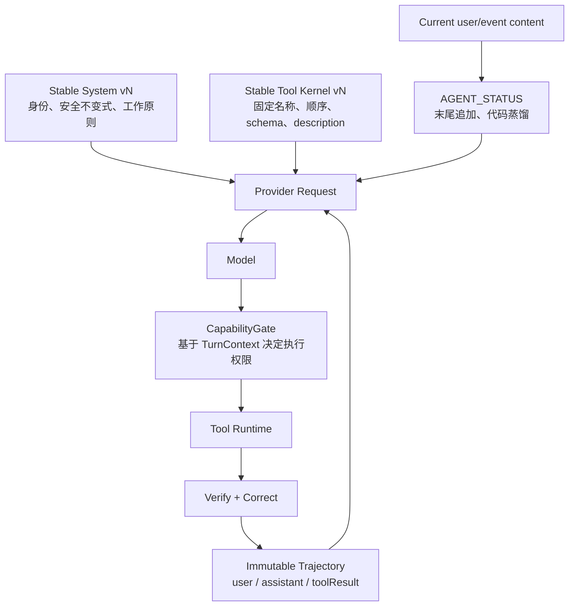

# Agent Context Cache V2：固定工具内核 + 追加式状态轨迹

**状态：** 目标架构
**日期：** 2026-08-11
**适用范围：** Qijian 单画布 Agent，包含 designer turn、工具跟进 turn、JOB wake、长桌面与项目记忆
**依据：** 李博杰《深入理解 AI Agent》v1.2 第 2 章“上下文工程”（PDF 35–76 页）、第 4 章“工具”（PDF 107–132 页），以及当前 pi 0.83.0 运行时行为。

---

## 1. 结论

Qijian 的 provider 请求固定为两段：

1. **静态前缀：** 版本化 System Prompt + 固定顺序 Tool Kernel schemas。
2. **追加轨迹：** 标准 user / assistant / toolResult 消息，每轮末尾追加由代码生成的 `AGENT_STATUS`。

designer、wake、工具发现和权限变化只更新 `TurnContext` 与 `CapabilityGate`；provider-visible `system` 和 `tools[]` 保持字节级一致。

**架构可以对“前缀稳定性”给出硬保证，对 provider 的实际 cache hit 给出有条件 SLO。** 首次冷启动、缓存 TTL 过期、provider 切换和新图像大块输入无法由应用层承诺 90% 命中。

---

## 2. 90% 的数学条件与 SLO

当前指标：

```text
hitRate = cacheRead / (input + cacheRead)
```

设可复用前缀为 `C`，当轮冷后缀为 `U`：

```text
C / (C + U) >= 0.90
等价于 C >= 9U
```

所以系统同时管理两个指标：

| 指标 | 定义 | 目标 |
|---|---|---|
| `prefix_stability_rate` | 可资格请求中，system/tools/history 前缀指纹与预期一致的比例 | ≥ 99.9% |
| `eligible_cache_hit_rate` | 满足前缀已预热、`C >= 9U`、模型与 cache epoch 不变的 turn 的 token 加权命中 | ≥ 92% |
| `turns_above_90` | 可资格 turn 中 `hitRate >= 0.90` 的比例 | ≥ 90% |
| `eligible_turn_coverage` | 全部 turn 中进入上述统计的比例 | ≥ 85% |

单独建档的冷轮次：

- `cold_thread_first`
- `cache_ttl_expired`
- `model_or_provider_changed`
- `context_epoch_changed`
- `compaction_first`
- `new_visual_payload`
- `provider_cache_unavailable`

全流量加权命中达到 90% 的前提，是这些冷 token 占比长期低于 10%。应用层通过缩小 `U`、降低冷轮次比例来接近这一条件。

---

## 3. 目标请求形状



线性消息结构：

```text
system = stable_system_prompt_vN
tools  = stable_tool_kernel_vN[]

messages = [
  user_1,
  assistant_1(tool_calls?),
  toolResult_1?,
  ...,
  user_n =
    <user_or_event_content source="...">...</user_or_event_content>
    + optional attachment manifest
    + optional compact desk delta
    + optional inspect references
    + AGENT_STATUS(current=true, seq=n)
]
```

`AGENT_STATUS` 永远位于当轮最后。历史状态保留在轨迹中，新状态用递增 `seq` 和 `current=true` 成为权威读数。

---

## 4. 固定 Tool Kernel

### 4.1 为什么不再动态更改 `tools[]`

pi 0.83.0 的 `setActiveToolsByName()` 同时更改 provider-visible schemas 和 SDK 内部 system base。这使“执行权限变化”与“缓存前缀变化”绑在一起。

V2 在 session create 时一次注册并激活 Tool Kernel，业务轮次使用 `CapabilityGate` 管理真实执行权限。

### 4.2 Kernel 建议

| 工具 | 类型 | 用途 |
|---|---|---|
| `look_at` | 感知 | 读指定物件像素，显式张数上限 |
| `look_at_desk` | 感知 | 读整桌布局总览 |
| `render_on_desk` | 执行 | `derive / replace / text_to_image` 的稳定 ACI，立即返回 task_id |
| `remove_from_desk` | 执行 | 独立高风险工具，便于确认和审计 |
| `get_task` | 感知 | 查指定 task |
| `cancel_task` | 执行 | 取消异步 task |
| `memory` | 感知/执行 | `inspect / search / record / forget` 的有界 action union |
| `search_capabilities` | 感知 | 检索低频能力，返回说明、schema、边界和例子 |
| `invoke_capability` | 执行 | 用 grant_id 调用低频能力，运行时严格验证参数 |
| `load_skill` | 感知 | 加载领域 Skill 正文，以 toolResult 追加到轨迹 |

这组工具在 `context_epoch` 内名称、顺序、JSON Schema 属性顺序和 descriptions 全部固定。工具契约变更时显式升级 epoch，进入一次可观测的重新预热。

### 4.3 渐进披露与稳定 schema 共存

`search_capabilities` 只在轨迹末尾返回命中能力：

```json
{
  "ok": true,
  "grant_id": "cap:export_board:policy-17",
  "capability": "export_board",
  "when": "用户明确要求导出桌面时",
  "input_schema": {},
  "examples": [],
  "expires_after_turn": 42
}
```

`invoke_capability` 透传参数，运行时 validator 按对应 schema 校验。规范化行为作为结果字段显式返回，使模型看到的参数与实际执行参数一致。

### 4.4 CapabilityGate

`CapabilityGate` 是执行真源，输入仅包含结构化字段：

```ts
type TurnContext = {
  runId: string;
  mode: "designer" | "wake";
  userAuthority: "explicit" | "implicit" | "event";
  deskRevision: string | "unknown";
  policyRevision: string;
  grantedCapabilities: string[];
};
```

决策矩阵：

| 模式 | 感知 | 生图 | 删除 | 记忆写 | 低频 capability |
|---|---:|---:|---:|---:|---:|
| designer + 用户明确意图 | 开 | 开 | 按明确删除意图 | 按记忆意图 | 按 grant |
| designer + 建议/分析 | 开 | 需要明确行动意图 | 需要明确行动意图 | 按稳定结论 | 按 grant |
| wake/event | 开 | 关 | 关 | 只读 | 只读 grant |

权限决策与 tool result 一起回写轨迹：`allowed / denied / reason / policy_revision`。高风险操作可在 Gate 后接结构化 Sidecar，Sidecar 只看 tool name、args、权限和资源归属。

---

## 5. 追加式 AGENT_STATUS

### 5.1 契约

```text
[AGENT_STATUS version=2 current=true seq=42]
turn: mode=designer source=user urgency=normal
desk: revision=d_91 state=unchanged manifest=desk://project/rev/d_91
selection: A03(artifact-id), A07(artifact-id)
jobs: revision=j_18 changed=task-1:succeeded
memory: revision=12 state=unchanged
capabilities: policy=designer grants=export_board
limits: inspect_images=4 generate=allowed delete=explicit_only
cache: epoch=ctx-v2 prefix_fingerprint=8f...
```

契约性质：

- `StatusBarAssembler` 只读数据库、Desk Manifest、Job Store、Memory Store 和当轮 `TurnContext`。
- 每轮追加新状态，历史消息保持不变。
- 状态指向实际执行策略；权限冲突由 `CapabilityGate` 裁决。
- 外部事件、项目名、附件文本和 captions 使用明确 source/untrusted 包装。
- 状态仅保留模型做下一步决策所需字段。

### 5.2 状态持久化

`ContextLedger` 按 `(projectId, threadId)` 持久化：

```ts
type ContextLedger = {
  contextEpoch: string;
  nextStatusSeq: number;
  lastStatusMessageId?: string;
  lastDeskRevision?: string;
  lastDeskManifest?: Record<string, string>;
  lastJobsRevision?: string;
  lastMemoryRevision?: number;
  lastPolicyRevision?: string;
};
```

Session 重建时读 Ledger，并校验 `lastStatusMessageId` 仍在当前轨迹中。轨迹与 Ledger 不同步时，当轮执行一次有预算的全量状态重同步。状态不由 LLM 扫描历史轨迹推导。

---

## 6. Desk Context：Manifest + Delta + Inspect

### 6.1 稳定别名

`A01…` 在 artifact 首次进入项目时由项目级 `DeskAliasRegistry` 分配并持久化，同一项目的不同线程共用同一别名。桌面排序和重载不再导致全量重编号。这使 desk delta 和历史引用保持稳定。

### 6.2 注入策略

| 条件 | 当轮注入 |
|---|---|
| 首次看到桌面 | 有预算的 manifest，超出部分用 cursor |
| revision 不变 | `desk: unchanged` |
| revision 变化 | added / updated / moved / removed 的 delta |
| 选中物件 | 精简 Focus + 稳定 alias/id |
| 需要像素判断 | 由 `look_at` 返回图像，结果进 toolResult |
| 需要整桌布局 | `look_at_desk` |

每条 user 消息默认不再重复内联选中图像。对话模型需要像素时显式使用感知工具。新图像本身是冷后缀，作为 `new_visual_payload` 单独计量。

### 6.3 软预算

`DynamicSuffixBudgeter` 使用最近一次可缓存前缀 token 估计值：

```text
target_uncached_tokens = min(absolute_cap, floor(cached_prefix_tokens / 9))
```

裁剪顺序：

1. jobs 历史细节收敛为 changed 行。
2. desk 非选中物件收敛为 manifest pointer + cursor。
3. memory 全文收敛为 revision + changed keys。
4. Focus 保留选中与一跳关键关系。
5. 当轮用户原文、权限、失败原因、task_id、artifact id 原样保留。

早期轮次中 `C < 9U` 时继续提供任务所需最小信息，按冷轮次记录，不通过无意义 padding 制造虚假高命中。

---

## 7. 工具结果与异步事件

### 7.1 统一结果包

```ts
type AgentToolResult<T> = {
  ok: boolean;
  code: string;
  summary: string;
  data?: T;
  stateDelta?: Record<string, unknown>;
  truncated?: { omitted: number; cursor?: string; resourceRef?: string };
  policy?: { allowed: boolean; revision: string; reason?: string };
};
```

感知工具支持 limit/cursor 与显式截断。长结果持久化后返回 resource reference，轨迹保留摘要、关键 ID 和继续读取方式。

### 7.2 异步生图

```text
assistant -> render_on_desk(..., idempotency_key)
toolResult -> accepted + task_id + artifact_id
assistant -> 告知用户任务已开始

后台完成 -> EventQueue
EventQueue -> user event envelope + AGENT_STATUS(mode=wake)
CapabilityGate -> wake 只读策略
assistant -> 说明成败，按需 look_at
```

事件包含 `event_id / task_id / status / artifact_id / error / occurred_at`，`event_id` 用于去重，`idempotency_key` 用于提交去重，`cancel_task` 承载取消语义。

JOB wake 只追加本次事件和 desk/jobs delta，无需重发整桌 Survey。

---

## 8. 压缩与 cache epoch

生产顺序：

1. 工具结果预算和显式截断。
2. 确定性去噪，保留业务结果、ID 和错误语义。
3. provider 支持的微压缩。
4. 轨迹归档摘要，保留决策理由和未解任务。
5. 全量压缩作为受控的新 `trajectory_epoch`。

压缩不修改 System/Tools epoch。压缩建立新 `trajectory_epoch`，同时清空 Ledger 中的“已注入 revision”记录，使下一轮重新发送有预算的 Desk/Jobs/Memory 权威状态。该轮标记 `compaction_first`，从再下一轮开始重新统计热缓存。

---

## 9. 并发与真源

- 每个 `(projectId, threadId)` 只有一个模型轮次修改轨迹，用户输入和普通事件进入有序队列。
- 紧急 stop 走取消通道，并为已发出的 tool call 完成配对结果。
- 工具闭包持有当轮不变的 `TurnContext`，不从全局队列头部推测 runId 或 mode。
- Desk、Job、Memory 状态通过 revision 或乐观锁更新，`ContextLedger` 在同一事务中推进。

---

## 10. CacheContract 与可观测性

### 10.1 每请求记录

```ts
type CacheObservation = {
  turnKind:
    | "cold_thread_first"
    | "cross_run_first"
    | "in_run"
    | "tool_followup"
    | "wake"
    | "new_visual_payload"
    | "compaction_first";
  contextEpoch: string;
  systemSha256: string;
  toolsSha256: string;
  historyPrefixSha256: string;
  cachedPrefixTokensEstimate: number;
  dynamicSuffixTokensEstimate: number;
  cacheEligible: boolean;
  ineligibleReason?: string;
  input: number;
  cacheRead: number;
  cacheWrite: number;
  hitRate: number | null;
};
```

### 10.2 请求前断言

`CacheContract.assert(request)` 验证：

1. system 与当前 `context_epoch` 的 golden bytes 一致。
2. tools 名称、顺序、schema 与 descriptions 的 canonical hash 一致。
3. 既有轨迹只追加，历史 message hash 不变。
4. 最新状态位于当轮 user/event 末尾。
5. tool call 与 toolResult 成对，`tool_call_id` 完整。
6. dynamic suffix 超预算时使用 delta/cursor/resource reference 重新编译。

### 10.3 回归测试

- designer → wake → designer：`systemSha256` 和 `toolsSha256` 全程不变。
- `search_capabilities` → `invoke_capability`：tools hash 不变，能力说明仅出现在 toolResult。
- 任意感知工具后的下一 model turn：system hash 不变。
- 桌面 revision 不变：当轮 desk 块为 `unchanged`。
- 大桌 revision 变化：只注入 delta，后缀在预算内。
- wake：生图和删除请求在 CapabilityGate 返回结构化 denied 结果。
- Session 重建：从 ContextLedger 继续 seq/revision，不重发整桌。
- 真实 provider 缓存基线：同线程 R1/R2、tool follow-up、wake、大桌 unchanged 四组分开验收。

---

## 11. 代码边界

```text
agent/context/
  stable-prefix.ts       # system/tool kernel 版本与指纹
  context-ledger.ts      # 跨 run 状态真源
  status-bar.ts          # AGENT_STATUS 编译
  desk-alias-registry.ts # 项目级稳定 alias
  desk-manifest.ts       # manifest + delta
  suffix-budgeter.ts     # C >= 9U 预算
  cache-contract.ts      # 请求前断言

agent/tools/
  kernel.ts              # 固定 provider-visible tools
  capability-catalog.ts  # 低频能力索引
  capability-gate.ts     # 运行时权限真源
  result-envelope.ts     # 截断/cursor/错误契约

agent/events/
  event-queue.ts         # 有序事件与去重
  event-envelope.ts      # 标准 user event 消息

agent/session-factory.ts # create 时一次设定固定 system/tools
agent/session-registry.ts# 持有 TurnContext，组装当轮 user + status
agent/usage-metrics.ts   # cohort + eligibility + cache SLO
```

`session-registry.ts` 只做轮次编排；Desk/Job/Memory 蒸馏、权限决策、工具路由和 cache 契约分别由独立组件拥有。

---

## 12. 迁移阶段

### M0：建立基线

- 增加 turn cohort、system/tools hash、dynamic suffix 估算和 eligibility。
- 保留当前行为，先获得 7 天流量分布。

### M1：固定前缀与 Tool Kernel

- 建立 `context_epoch=ctx-v2`。
- Session create 时一次设定 system/tools。
- designer、wake、search 走 TurnContext/CapabilityGate。
- 应用路径统一为 V2 工具契约，新 epoch 首轮重新预热。

### M2：状态轨迹与 Desk Delta

- 建 ContextLedger、稳定 alias、AGENT_STATUS 和 revision short-circuit。
- 选中像素改为按需 `look_at`。
- wake 只回注 event + delta。

### M3：工具结果预算与异步契约

- 统一 result envelope、cursor、resource reference、idempotency key 和 cancel。
- 以结构化 Sidecar 覆盖高风险路径。

### M4：SLO 放量

- 1% → 10% → 50% → 100% 按 `prefix_stability_rate`、工具成功率、wake 副作用和 eligible cache hit 逐级放量。
- 每次 system/tool contract 变更显式升级 context epoch，以独立 cohort 观测预热。

---

## 13. 最终验收

1. 同一 context epoch 内，designer、wake、search、tool follow-up 的 system/tools canonical hash 完全一致。
2. 可资格 turn 中，90% 以上的 turn 达到 `hitRate >= 0.90`，token 加权命中达到 92% 以上。
3. 大桌 unchanged 和 wake 的动态 desk 后缀收敛为小型状态/delta，不再出现 10 万级冷 input。
4. wake 模式的写操作由 CapabilityGate 确定性拒绝，不依赖模型自觉。
5. 工具的参数、实际执行值和结果语义可完整审计；异步任务具有 task_id、事件、去重和 cancel 闭环。
6. prefix 指纹异常在请求前被 CacheContract 阻断或降级为明确的冷 epoch，不以未分类 cache miss 进入生产统计。

---

## 14. 与本书原则的映射

| 书中原则 | V2 落点 |
|---|---|
| System + Tools 定了不改 | Stable Prefix + Tool Kernel + context epoch |
| 动态信息追加末尾 | 追加式 AGENT_STATUS |
| 标准 API messages | user / assistant / toolResult 严格成对 |
| 状态栏由代码蒸馏 | ContextLedger + StatusBarAssembler |
| Skills 渐进披露 | load_skill 结果追加轨迹 |
| 工具动态发现 | search_capabilities + invoke_capability，不修改 tools[] |
| ACI 与参数保真 | 固定 Kernel、边界/例子、严格 validator、显式规范化 |
| Constrain / Verify / Correct | CapabilityGate + Sidecar + result envelope |
| 感知结果显式截断 | limit/cursor/resource reference |
| 异步 task_id + 事件 + cancel | EventQueue + wake status + idempotency |
| 压缩与隔离 | 分层预算、归档 epoch、大结果持久化 |
