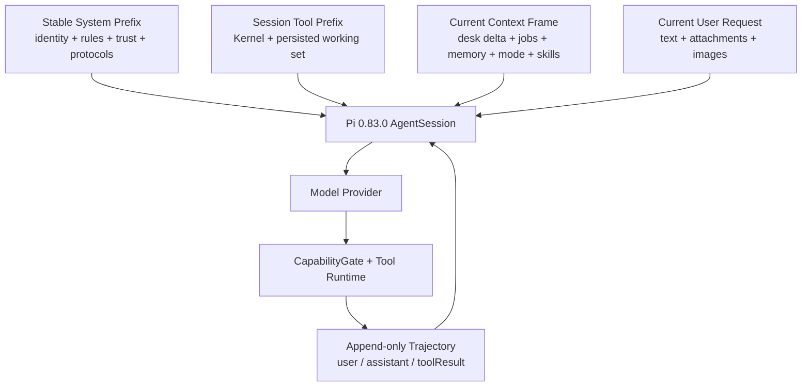
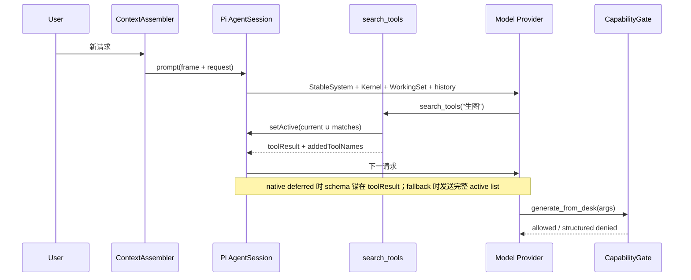

# Agent 上下文、工具与 Skills 高缓存架构

**状态：** 迁移中；M0–M5 已落地，进入 M6 SLO 放量
**日期：** 2026-08-12
**运行时基线：** `@earendil-works/pi-coding-agent@0.83.0`
**外部实现基线：** Akashic Agent `a40f72923aa3a72b31bb2d81dac1cf9c6529b740`
**目标：** 保留当前桌面 Agent 能力，并让稳定态请求的 token 加权 Prompt Cache 命中率长期保持在 90% 以上
**适用范围：** designer turn、ReAct 工具跟进、JOB wake、桌面感知、项目记忆、内置 Skills、长会话压缩

当前已经落地的模块、真实请求格式和运行边界见 [Agent 上下文管理模块：当前实现](agent-context-management.md)。本文保留设计依据、迁移过程与 SLO 验收标准。

---

## 1. 架构结论

Qijian 采用四层上下文：

1. **Stable System Prefix**：身份、行为规则、信任边界、通用工具与 Skill 协议；在 `context_epoch` 内字节级稳定。
2. **Session Tool Prefix**：常驻工具内核 + 会话工作集；工具发现只做 additive activation，新增 schema 由 Pi deferred loading 锚在 `toolResult` 位置。
3. **Append-only Trajectory**：标准 `user / assistant / toolResult` 轨迹，只追加；工具调用和结果完整配对。
4. **Current Context Frame**：桌面、任务、记忆、mode、权限、显式 Skill 等当前局面，由代码蒸馏后放在最新 user 消息的前半段，用户原文保持在消息末尾。



低频能力继续以原来的真实工具名和 JSON Schema 暴露。`tools[]` 初始只承载 Kernel 与会话 Working Set；`search_tools` 命中后，Pi 在下一次模型请求中加载对应真实定义。

---

## 2. 设计依据与采用范围

| 来源 | 已验证机制 | Qijian 采用方式 |
|---|---|---|
| Akashic Prompt Assembler | 稳定 system、历史、晚到 context frame、当前用户消息的固定顺序 | 建立唯一 `ContextAssembler`，动态局面后置 |
| Akashic Tool Discovery | always-on + session LRU + 当前轮 newly unlocked；schema 顺序确定 | 常驻 Kernel + 持久化 Session Working Set + 追加式解锁 |
| Akashic Query Compaction | 仅压缩闭合工具批次，以成对消息表达压缩边界 | 工具结果先预算；长 ReAct 只在闭合批次边界压缩 |
| Akashic Cache Routing | 按 runtime/model/session 生成稳定 cache key | 沿用 Pi 稳定 `sessionId` 路由，并做 provider payload 验证 |
| Pi 0.83.0 Dynamic Tool Loading | 纯 additive 的 `setActiveTools` 自动记录 `addedToolNames`；支持原生 deferred 的模型将定义锚在搜索结果处 | `search_tools` 只增量激活；常规 turn 与 wake 均维持工作集 |
| Pi 0.83.0 Skills | 元数据常驻、正文按需加载 | 内置 Skill 元数据索引 + `search_skills/load_skill` 渐进披露 |
| Pi 0.83.0 Compaction | summary + retained messages；切点保持 tool call/result 语义完整 | 保留 Pi 会话压缩，压缩后触发一次权威状态重同步 |
| 《深入理解 AI Agent》Ch2/Ch4 | 稳定前缀、动态信息末尾追加、标准消息、状态栏、渐进披露、执行约束、异步事件 | 作为 Harness 设计原则，不替代实际运行时事实 |

关键来源：

- [Akashic Prompt Assembler：动态 sections 移入 context frame](https://github.com/kachofugetsu09/akashic-agent/blob/a40f72923aa3a72b31bb2d81dac1cf9c6529b740/agent/prompting/assembler.py#L49-L157)
- [Akashic 消息顺序：system → history → context frame → current user](https://github.com/kachofugetsu09/akashic-agent/blob/a40f72923aa3a72b31bb2d81dac1cf9c6529b740/agent/context.py#L82-L114)
- [Akashic 会话工具 LRU](https://github.com/kachofugetsu09/akashic-agent/blob/a40f72923aa3a72b31bb2d81dac1cf9c6529b740/agent/core/runtime_support.py#L32-L155)
- [Akashic 可见工具与确定性顺序](https://github.com/kachofugetsu09/akashic-agent/blob/a40f72923aa3a72b31bb2d81dac1cf9c6529b740/agent/core/passive_turn.py#L1345-L1418)
- [Akashic 闭合工具批次压缩](https://github.com/kachofugetsu09/akashic-agent/blob/a40f72923aa3a72b31bb2d81dac1cf9c6529b740/agent/model_runtime/query_compaction.py#L298-L387)
- [Akashic 稳定 Prompt Cache 路由键](https://github.com/kachofugetsu09/akashic-agent/blob/a40f72923aa3a72b31bb2d81dac1cf9c6529b740/agent/provider.py#L758-L793)
- [Pi 0.83.0 Dynamic Tool Loading](https://github.com/earendil-works/pi/blob/v0.83.0/packages/coding-agent/docs/extensions.md#dynamic-tool-loading)
- [Pi 0.83.0 Skills 渐进披露](https://github.com/earendil-works/pi/blob/v0.83.0/packages/coding-agent/docs/skills.md#how-skills-work)
- [Pi 0.83.0 Compaction](https://github.com/earendil-works/pi/blob/v0.83.0/packages/coding-agent/docs/compaction.md#compaction)
- [OpenAI Prompt Caching：静态在前、动态在后、精确前缀匹配](https://developers.openai.com/api/docs/guides/prompt-caching#structuring-prompts)
- [Claude Prompt Caching：tools → system → messages 缓存层级](https://platform.claude.com/docs/en/build-with-claude/prompt-caching#structuring-your-prompt)
- 李博杰《深入理解 AI Agent》v1.2，第 2 章与第 4 章；配套仓库：[bojieli/ai-agent-book](https://github.com/bojieli/ai-agent-book)

---

## 3. 当前实现事实与迁移状态

### 3.1 已有能力

| 能力 | 当前实现 |
|---|---|
| Pi 会话与历史 | `SessionManager.continueRecent()` 持久化 JSONL 轨迹 |
| 自定义工具 | `createDeskTools()` 全量注册，Pi `tools` allowlist 覆盖所有自定义工具名 |
| 工具发现 | 窄 base + `search_tools` + `setActiveToolsByName()` |
| 会话工具工作集 | `SessionToolState` 持久化 capacity=5 的 LRU，Registry schema revision 变化时开启新 `tool_epoch` |
| 桌面上下文 | 每轮组装 Survey / Focus / Inspect，并传入选中图像 |
| 异步任务 | accepted + task_id，完成后 JOB_EVENT wake |
| 项目记忆 | 每轮注入 compiled memory，提供 inspect/search/record/forget 工具 |
| Skills | 内置审计目录，`search_skills` 返回元数据，`load_skill` 返回正文 |
| Cache usage | 从 Pi assistant usage 采集 `input/cacheRead/cacheWrite` |

### 3.2 M1 前的稳定前缀断点

```text
每个 designer turn
  → reset 到 narrow base
  → setActiveToolsByName(base)
  → composeSystemPrompt(identity, active)
  → 写 session.agent.state.systemPrompt

search_tools
  → active ∪ matches
  → 再次 setActiveToolsByName
  → 再次重写 system

JOB wake
  → replace 为 wake tool set
  → 再次重写 system
```

以上路径已在 M1 移除。当前代码状态：

- [`system-prompt.ts`](../apps/server/src/agent/system-prompt.ts) 只生成会话级 Stable System。
- [`tool-activation.ts`](../apps/server/src/agent/tools/tool-activation.ts) 只改变 Pi active tools，不写 `agent.state.systemPrompt`。
- [`search-tools.ts`](../apps/server/src/agent/tools/search-tools.ts) 只执行 additive activation，已发现工具跨 designer/wake run 保留。
- [`session-tool-state.ts`](../apps/server/src/agent/tools/session-tool-state.ts) 按会话保存 Working Set、LRU 热度、上次 active set 和 `tool_epoch`，并用临时文件 + rename 原子落盘。
- [`capability-gate.ts`](../apps/server/src/agent/capability-gate.ts) 使用 run-scoped `TurnContext` 裁决 wake 权限。
- [`cache-contract.ts`](../apps/server/src/agent/cache-contract.ts) 生成 system/tools/history 指纹，并在同一 Session 内强校验 System hash。
- [`current-context-frame.ts`](../apps/server/src/agent/context/current-context-frame.ts) 编译 canonical Turn Envelope，持久化 Desk/Jobs/Memory revision 与 manifest，并在 compaction 后强制 full resync。
- [`suffix-budgeter.ts`](../apps/server/src/agent/context/suffix-budgeter.ts) 对大桌 full/resync 执行 XML 转义后的 12,000 字符硬预算，优先保留 Focus/Inspect 关联对象，并把完整桌面写入可分页 Resource Store。
- [`desk-alias-registry.ts`](../apps/server/src/agent/context/desk-alias-registry.ts) 按项目持久化 artifact 的稳定 alias，跨 run、thread 和 session resume 复用。

当前 Desk、Jobs、Memory 已进入 Current Context Frame：首轮/epoch 重置发 full，revision 不变发 unchanged，变化时发 added/updated/removed delta。大桌 full/resync 已有硬预算与 resourceRef；剩余冷后缀主要是当轮 Focus、Inspect、附件和真实状态变化。

### 3.3 Pi 版本事实

Pi 0.83.0 的 `setActiveToolsByName()` 会更新 `agent.state.tools`，并重建 base system。Qijian 使用 `DefaultResourceLoader({ systemPrompt: identity })` 的 custom prompt 路径；Pi 的 `buildSystemPrompt()` 在该路径下返回 custom prompt、固定 cwd 与资源附加内容，不会把 active tool 的 `promptSnippet/promptGuidelines`拼入 system。

当前实现已经满足：

- `setActiveToolsByName()` 负责改变 Pi 的 active tool schemas。
- Qijian 的 custom system 在 `context_epoch` 内保持完全相同。
- 工具细则放进每个工具自身的稳定 `description`，搜索结果只追加短提示。
- 业务代码不直接写 `session.agent.state.systemPrompt`。

Pi 还会把工具执行前后的纯新增集合写成 `toolResult.addedToolNames`。原生 deferred provider 以该字段为加载点；普通 provider 在下一请求发送完整 active list。这个差异必须由运行时能力探测和真实 payload canary 确认。

---

## 4. 五条架构不变式

### I1. Stable System

同一 `context_epoch` 中，所有 designer、tool follow-up、wake 请求使用相同 `system_sha256`。

System 只包含：

- 产品身份与已配置模型事实
- 桌面协作原则与事实分层
- 不可信数据的来源处理规则
- 工具发现、Skill 加载、异步事件的一般协议
- CapabilityGate 拒绝结果的处理方式
- 小型、稳定、版本化的 Skill 元数据索引（可选，受预算控制）

桌面 revision、active tools、mode、task、memory revision、时间与检索结果归入 Current Context Frame。

### I2. Append-only Trajectory

已发送并持久化的消息内容保持不变。新信息以新消息追加；assistant tool call 与对应 toolResult 成对保留。压缩创建新的 `trajectory_epoch`，而不是改写旧消息。

### I3. Additive Tool Discovery

一次 `tool_epoch` 内：

```text
next_active_tools = current_active_tools ∪ search_matches
```

现有 active tools 保持原顺序，新增工具按 Registry 固定顺序追加。每个用户 turn 沿用 Session Working Set。wake 通过 CapabilityGate 收窄执行权限，同时保留 provider-visible 工作集。

### I4. Code-distilled Current State

Desk、Jobs、Memory、权限与 Skill 状态由代码和存储 revision 生成。模型读取状态，不承担扫描长轨迹后统计局面的职责。

### I5. Deterministic Serialization

同一逻辑输入产生相同字节：

- tool registry、skill catalog 与对象字段使用稳定排序
- JSON Schema 属性顺序由版本化定义固定
- 空字段采用统一省略策略
- 换行、标记、布尔值和枚举使用 canonical formatter
- 每次请求记录 system/tools/history/context frame 指纹

---

## 5. Provider 请求与消息组装格式

### 5.1 逻辑顺序

```text
Provider Request
├── system: StableSystem(context_epoch)
├── tools: PiToolView(tool_epoch)
└── messages
    ├── history: persisted user / assistant / toolResult
    ├── history: optional compactionSummary + retained tail
    └── current user message
        ├── <system_context_frame current="true" ...>
        │   ├── turn / authority / mode
        │   ├── desk full | delta | unchanged
        │   ├── focus / inspect index
        │   ├── jobs delta
        │   ├── memory full | delta | unchanged
        │   ├── active skills / loaded revisions
        │   ├── tool working set / deferred names
        │   └── execution policy snapshot
        └── <user_request source="interactive|event">
            ├── 用户原文或结构化 JOB_EVENT
            ├── 附件 manifest
            └── image contents
```

Akashic 使用独立 pseudo-user context frame 后再追加 current user。Pi 0.83.0 的公开 `AgentSession.prompt()` 接受一条文本 user message，因此 Qijian 首期把 frame 与 request 编译进同一条 user message，并确保用户请求位于末尾。若未来 Pi 提供多消息 prompt API，可在不改变语义契约的前提下拆成两条消息。

### 5.2 Canonical Turn Envelope

```xml
<system_context_frame version="1" current="true" seq="42" context_epoch="ctx-3" trajectory_epoch="2">
  <turn source="interactive" mode="designer" authority="user_explicit" />
  <desk revision="d_91" state="delta">
    <added>A08|artifact-id|效果图 4|ready</added>
    <updated>A03|artifact-id|selected=true</updated>
    <removed>A05|artifact-id</removed>
  </desk>
  <focus ids="artifact-id-1,artifact-id-2" />
  <inspect ids="artifact-id-1" image_indexes="1" />
  <jobs revision="j_18">task-7:succeeded:artifact-id-8</jobs>
  <memory revision="12" state="unchanged" />
  <skills active="design-language@4" loaded="design-language@4" />
  <tools epoch="tool-7" active="search_tools,look_at,look_at_desk,generate_from_desk" />
  <execution policy_revision="wake-3" generate="allowed" delete="explicit_only" />
</system_context_frame>

<user_request source="interactive">
请基于第一张图再出两个更克制的方向。
</user_request>
```

该 envelope 是系统生成数据。用户原文、附件文本、caption、项目名和外部事件各自带 `source`，System 中的信任规则决定如何使用它们。

### 5.3 Context Ledger

```ts
type ContextLedger = {
  version: 1;
  contextEpoch: string;
  trajectoryEpoch: number;
  nextFrameSeq: number;
  lastTrajectoryAnchor?: string;
  lastDeskRevision?: string;
  lastDeskManifest: Record<string, DeskManifestEntry>;
  lastJobsRevision?: string;
  lastJobsEntries: Record<string, JobFrameEntry>;
  lastMemoryRevision?: string;
  lastMemoryEntries: Record<string, MemoryFrameEntry>;
};
```

Ledger 按 `(projectId, threadId)` 持久化。Session 重建时校验 `lastTrajectoryAnchor`、`contextEpoch` 与当前 Pi 轨迹 hash。校验通过后继续 delta；校验不一致或发生 compaction 时发送一次受硬预算约束的 full resync。Tool Working Set 由同目录的 `tool-state.json` 独立持久化，避免工具 epoch 与轨迹 epoch 相互耦合。

---

## 6. 工具架构：Kernel + Session Working Set + Deferred Load

### 6.1 三个集合

```text
RegisteredCatalog  = 当前 runtime snapshot 的全部工具实现与 schema
KernelSet          = 每个会话始终可见的高频工具
SessionWorkingSet  = 本会话已发现并保温的低频工具，默认容量 5

ProviderVisible = KernelSet + SessionWorkingSet + CurrentRunAdditions
Executable      = ProviderVisible ∩ CapabilityGate(turnContext)
```

建议 Kernel：

| 工具 | 原因 |
|---|---|
| `search_tools` | 所有低频能力的统一发现入口 |
| `look_at` | 高频、只读、像素事实入口 |
| `look_at_desk` | 高频、只读、布局事实入口 |

低频工具仍保持当前真实接口，例如 `generate_from_desk`、`replace_on_desk`、`remove_from_desk`、memory 工具、`get_task`、`search_skills`、`load_skill`。搜索后模型直接调用这些工具。

### 6.2 生命周期



### 6.3 Session Working Set

采用 Akashic 的会话级 LRU 思路，同时适配 Pi 的 additive 约束：

1. Session create/resume 时加载 `Kernel + persisted working set`，顺序由 Registry 固定。
2. 当前 run 内搜索只追加工具；Pi 可记录 `addedToolNames`。
3. 搜索成功的工具立即进入 Working Set，保证下一轮仍可见；实际调用成功后再将它提升为 MRU。
4. 容量未溢出时，下个 run 复用完全相同的 active set。
5. 容量溢出时，在下个用户边界建立新的 `tool_epoch`，一次性发布 `Kernel + 新 LRU`；该请求标记为 `tool_epoch_changed`，随后重新进入稳定态。
6. Registry 的名称、顺序或 schema 修订变化时，清空旧 Working Set 并推进一次 `tool_epoch`，使新 schema 边界明确可观测。

这让常用工具跨 run 保温，并把工具集合替换收敛为低频、可观测的 epoch 事件。

### 6.4 Native Deferred 与 Fallback

Pi 0.83.0 文档列出两条路径：

| 路径 | 行为 | Cache 预期 |
|---|---|---|
| `native_deferred` | 新 schema 在 search toolResult 位置加载，初始工具 schema 前缀保持稳定 | 搜索后的下一次 ReAct 仍可复用此前前缀 |
| `fallback_active_list` | 下一请求发送完整当前 active tool list | 激活边界可能冷一次，工作集稳定后恢复 |

`ProviderCapabilityProfile` 以 Pi model compat 与真实 canary 为准：

```ts
type ProviderCapabilityProfile = {
  api: string;
  nativeDeferredTools: boolean;
  promptCacheKeyForwarded: boolean;
  cacheUsageReported: boolean;
  cacheRetention: "unknown" | "short" | "long";
  verifiedAt: string;
};
```

当前默认 provider/model 是可配置的代理组合。架构以 Pi model compat 和 staging payload canary 作为 native deferred 能力真源；canary 捕获脱敏后的 provider payload，确认新增定义的位置、`prompt_cache_key` 和 usage 语义。

### 6.5 Tool Description 与执行保真

每个低频工具的稳定 `description` 包含：

- 适用意图
- 与相邻工具的选择边界
- 关键参数与真实例子
- 异步语义、task_id 与完成条件
- 截断、分页或幂等规则

Kernel 的通用规则进入 Stable System，工具选择细则进入各自稳定 `description`。Pi custom system 路径当前不会拼入 `promptSnippet/promptGuidelines`，因此运行语义不依赖这两个字段；lazy 工具仅凭自身 description 即可完成正确选择。参数规范化在 tool result 中显式返回 `normalized_args`，使模型所见参数与实际执行一致。

---

## 7. CapabilityGate：权限变化与 schema 变化解耦

```ts
type TurnContext = {
  projectId: string;
  threadId: string;
  runId: string;
  source: "interactive" | "job_event";
  mode: "designer" | "wake";
  authority: "user_explicit" | "user_implicit" | "system_event";
  policyRevision: string;
  selectedArtifactIds: string[];
};
```

| 场景 | 感知 | 生图/替换 | 删除 | 记忆写 | Skill |
|---|---:|---:|---:|---:|---:|
| designer + 明确行动意图 | 允许 | 允许 | 按明确删除意图 | 按稳定结论 | 搜索/加载 |
| designer + 分析建议 | 允许 | 由意图策略裁决 | 由意图策略裁决 | 按稳定结论 | 搜索/加载 |
| wake / job event | 允许 | 返回结构化拒绝 | 返回结构化拒绝 | 只读 | 已加载 Skill 可读 |

Gate 读取当前 run 的不可变 `TurnContext`。工具闭包直接捕获该快照，mode 与 authority 均来自 run-scoped 状态。Gate 输出进入标准 toolResult：

```json
{
  "ok": false,
  "code": "WAKE_READ_ONLY",
  "summary": "当前轮次用于汇报后台任务结果；等待新的用户操作请求后可继续生成。",
  "policy": {
    "allowed": false,
    "revision": "wake-3"
  }
}
```

因此 wake 无需替换 Pi active tools，cache 前缀保持稳定，执行安全由 Harness 确定性实现。

---

## 8. Skills 架构：Metadata → Body → References

### 8.1 Registry Snapshot

Qijian 保持 `noSkills: true`，由产品内置、经过审查的 SkillRegistry 提供唯一运行时快照：

```ts
type SkillCatalogEntry = {
  name: string;
  description: string;
  whenToUse: string[];
  revision: string;
  bodyPath: string;
  baseDir: string;
};
```

目录按 `name` 稳定排序，正文 revision 由内容哈希生成。发布新 SkillRegistrySnapshot 时升级 `context_epoch`，现有 session 在下一边界显式重同步。

### 8.2 三层披露

| 层 | 内容 | 注入位置 |
|---|---|---|
| L0 | 稳定小型索引：name + 一句话 description，受固定 token 预算约束 | Stable System 或 `search_skills` 工具描述 |
| L1 | `search_skills` 命中的 name/description/whenToUse/revision | toolResult，追加到轨迹 |
| L2 | `load_skill` 返回完整 SKILL.md 与 baseDir | toolResult，emit once |
| L3 | Skill 引用的 reference/script/assets | 按 Skill 流程由专用资源工具读取 |

当前 Skill 数量很少时，L0 可进入 Stable System；索引超过预算后，Stable System 只保留领域分类与 `search_skills` 协议，详细元数据由搜索返回。这个选择在构建期确定，并随 `context_epoch` 版本化。

### 8.3 显式 `$skill` 与自然语言

- 用户显式 `$skill-name`：`SkillResolver` 确定性解析并把正文放入本轮 Current Context Frame；同一 `name@revision` 在一个 trajectory epoch 内只注入一次。
- 自然语言匹配：模型先调用 `search_skills`，再调用 `load_skill`。
- 已加载 Skill：Context Frame 记录 `name@revision`；正文继续留在轨迹中。
- Compaction 后：Ledger 清空 emit-once 标记；下一次需要该 Skill 时重新加载正文。

显式路径与工具路径共享同一 `loadedSkillRevisions`，从而避免同一轮同时自动注入和再次 `load_skill`。

Skill 正文提供领域流程，不改变 CapabilityGate 权限。生图、删除、写记忆仍由对应真实工具和执行策略完成。

---

## 9. Desk、Jobs 与 Memory 的增量上下文

### 9.1 Desk Manifest

项目级 `DeskAliasRegistry` 为 artifact 分配稳定 alias。位置变化、session 重建和不同 thread 继续引用相同 alias。

| 条件 | Context Frame 内容 |
|---|---|
| session 首次看到桌面 | 有预算的 full manifest |
| revision 相同 | `state=unchanged` + revision |
| revision 变化 | added / updated / moved / removed delta |
| 选中物件 | Focus L2；稳定 alias + artifact id |
| 需要像素事实 | `look_at` 的图像 toolResult |
| 需要整桌布局 | `look_at_desk` 的 overview toolResult |
| compaction / ledger mismatch | 有预算的 full resync |

Survey 的“当前性、全桌可指认、Focus、Inspect”语义继续保留；传输形态由每轮完整目录演进为 `full | delta | unchanged`。本文在 KV Cache 注入频率上优先于 [agent-desk-context-assembly.md](agent-desk-context-assembly.md) 的“每轮完整 Survey”描述。

### 9.1.1 大桌 full/resync 硬后缀预算

`state=full` 的 Desk body 按 XML 转义后的实际帧字符数计算，硬上限为 12,000。该上限只作用于 Desk full body；本轮 Selection、Focus 与 Inspect 位于独立的 `request_context`，继续完整保留。

基准测量中，10 / 50 / 100 / 200 个对象的完整 Desk 分别约为 2,659 / 13,293 / 26,597 / 53,732 字符。超过上限时，`DeskFullSuffixBudgeter` 按以下顺序生成确定性紧凑目录：

1. Focus 对象；
2. Focus 一跳邻接；
3. Inspect 已纳入对象；
4. 其余对象按稳定 alias 与 artifact id 排序。

压缩帧包含 `[DESK_FULL_TRUNCATED]`、保留/省略对象数和 `resource_ref`。原始 full 文本写入 session 级内容寻址 Resource Store；模型仅在紧凑目录与 Focus/Inspect 不足以回答时调用 `read_context_resource` 分页核对。存储不可用时帧明确标记 `resource_status=unavailable`，并仍满足硬上限。

预算器只在 Ledger 判定本轮确实发送 full 时运行；delta 与 unchanged 不访问 Resource Store。trace 记录截断标志、压缩前后字符数、省略对象数与资源状态，不记录资源引用正文。

### 9.2 Jobs

JOB_EVENT 只追加本次事件及受影响 artifact/task：

```text
event_id / task_id / status / artifact_id / error / occurred_at
```

`event_id` 去重，提交使用 idempotency key，取消由 `cancel_task` 承载。wake frame 使用 `mode=wake`，CapabilityGate 自动应用只读策略。

### 9.3 Memory

| 条件 | 注入 |
|---|---|
| 首次 / resync | 有预算的 compiled memory full |
| revision 相同 | `memory state=unchanged revision=N` |
| revision 变化 | upsert keys + removed keys + 新 revision |
| 需要完整核对 | `inspect_project_memory` |
| 需要定向查找 | `search_project_memory` |

Memory delta 包含删除 tombstone，确保轨迹中的旧事实不会继续被当作当前值。

---

## 10. 工具结果预算与压缩

### 10.1 已落地的 Result Budget

```ts
type ToolResultBudgetMetrics = {
  schema_version: 1;
  category: "control" | "retrieval" | "perception" | "error";
  max_text_chars: number;
  truncated: boolean;
  original_text_chars: number;
  emitted_text_chars: number;
  saved_text_chars: number;
  image_count: number;
  image_base64_chars: number;
  resource_ref?: `ctxres:sha256:${string}`;
  next_cursor?: string;
};

type AgentToolResultWithBudget<T> = AgentToolResult<T & {
  result_budget: ToolResultBudgetMetrics;
}>;
```

所有工具在注册时采用同一条执行链：

```text
CapabilityGate → 原始工具 → ResultBudget → Pi trajectory / 持久化 / trace
```

这使真实工具结果、Gate 拒绝结果和读取资源结果遵循同一预算协议。当前字符预算为：

| 类别 | 上限 | 工具示例 |
|---|---:|---|
| control | 1,500 | 生图受理、删除、任务状态、记忆写入 |
| error | 2,000 | 任意 `ok=false` / failed / error 结果 |
| perception | 4,000 | `look_at`、`look_at_desk` 的文字部分 |
| retrieval | 6,000 | Memory / Skill 检索与资源分页 |

预算只处理文字块，图像块保持原始像素；`image_count` 与 `image_base64_chars` 单独度量。短结果的文字内容保持不变，只在 `details.result_budget` 增加有界指标。

### 10.2 Context Resource Store

超限文字在进入轨迹前替换为有界预览和确定性标记：

```text
[TOOL_RESULT_TRUNCATED]
resource_ref=ctxres:sha256:<content-hash>
next_cursor=0
original_text_chars=<n>
```

完整文字写入当前 session 的内容寻址只读资源存储。资源文件采用原子 rename 落盘，引用同时绑定来源工具名和全文内容；读取时复算哈希，避免错误文件被当作原结果。相同内容得到相同引用。

`read_context_resource` 是 Kernel 常驻、不可搜索移除的只读工具，也允许在 wake 轮执行。模型仅在预览不足时按 `resource_ref + cursor` 继续读取，单页最多 5,500 字符；返回值仍经过 ResultBudget，因此分页不会递归制造新的超长结果。资源正文标记为 `untrusted_tool_data`。

若资源落盘失败，轨迹仍保留有界预览并写明 `resource_status=unavailable`，保证单次工具异常不会把后续上下文重新撑大。

### 10.3 观测

预算指标同时进入：

- `chat_tool_calls.details.result_budget`，用于逐次结果审计；
- tool trace span 的独立 `outputs.result_budget`，即使完整 result 因 trace 上限被裁剪，预算指标仍可聚合。

推荐按工具类别聚合 `truncated` 比例、`saved_text_chars`、`image_base64_chars`，并关注资源读取失败率；资源引用不作为指标标签，避免高基数。

### 10.4 分层压缩

1. 工具结果在写入轨迹前执行上述统一预算。
2. Desk/Jobs/Memory 使用 revision delta。
3. Pi 到达 context 阈值后生成 compaction summary，并保留 recent tail。
4. ToolBatchLedger 在 `session_before_compact` 提取已经闭合的 assistant tool call + toolResult 批次。
5. 压缩后建立新 `trajectory_epoch`，下一轮发送一次 Desk/Jobs/Memory/Skill resync。

Pi 默认摘要继续负责自然语言目标、约束、设计判断与原因；ToolBatchLedger 提供确定性的结构化补强：

- 从 `<user_request>` 保留最近目标，从无工具调用的 assistant 消息保留最近结论；
- 每个批次只有在全部 call id 都存在后续 toolResult 时才进入 Ledger；开放批次整体留给 recent tail；
- 从参数与结果的允许字段中提取 artifact/task/file/skill ID、stable key、revision、状态、error code 与 resourceRef；
- 历史 Ledger 从隐藏 custom message 的结构化 details 合并，损坏快照会被忽略；
- 最多保留最近 24 个闭合批次，最终文本硬限制 10,000 字符，优先淘汰最旧批次；
- `session_compact` 后把 Ledger 作为隐藏、持久化、参与 LLM context 的消息追加到新轨迹。

Pi cut point 保证不会从 toolResult 开始保留 recent tail；ToolBatchLedger 又只处理完整批次，因此压缩摘要不会制造缺少对应结果的工具调用。工具长输出的可复查全文继续留在 Resource Store。

Trace 的 `context.compaction` span 记录 source/summary 字符数、闭合批次与调用数、开放调用数、孤立结果数、携带/丢弃批次数和估算节省字符。所有标签均来自固定低基数集合，resourceRef 只作为历史数据保留。

---

## 11. Cache Contract 与 90% SLO

### 11.1 两个命中率口径

Pi 将 uncached input、cache read 和 cache write 分开归一化。当前代码使用：

```text
read_hit_rate = cacheRead / (input + cacheRead)
```

架构观测新增包含写入成本的口径：

```text
effective_reuse_rate = cacheRead / (input + cacheRead + cacheWrite)
```

聚合必须先求和再相除：

```text
weighted_effective_reuse
  = ΣcacheRead / (Σinput + ΣcacheRead + ΣcacheWrite)
```

“90%+”指 token 加权缓存读取比例，不代表 90% 的请求完全来自缓存。

### 11.2 数学条件

设可复用前缀为 `C`，当轮冷后缀为 `U`，cache write 为 `W`：

```text
read_hit_rate:       C / (C + U)     >= 0.90  → C >= 9U
effective_reuse_rate: C / (C + U + W) >= 0.90  → C >= 9(U + W)
```

因此架构同时稳定 `C` 并压缩 `U`。早期短会话尚未积累足够前缀时，单轮 90% 在数学上并不成立；这些轮次仍进入全流量报表。

### 11.3 硬保证与运行 SLO

应用层可以确定性保证：

| 指标 | 目标 |
|---|---:|
| `system_prefix_stability` | 同 context epoch 为 100% |
| `history_append_only` | 非 compaction turn 为 100% |
| `tool_order_determinism` | 同 tool epoch 为 100% |
| `frame_canonicalization` | 同输入 fixture hash 为 100% |
| `wake_write_gate_accuracy` | 100% |

Provider 结果按 SLO 管理：

| 指标 | 目标 |
|---|---:|
| 稳定态 eligible turn 的 token 加权 `read_hit_rate` | ≥ 92% |
| 稳定态 eligible turn 中 `read_hit_rate ≥ 90%` 的比例 | ≥ 90% |
| 7 日全流量 token 加权 `effective_reuse_rate` | ≥ 90% |
| `context_epoch/tool_epoch/trajectory_epoch` 冷 token 占比 | ≤ 8% |

Provider TTL、路由、模型/API 切换和原生 deferred 支持属于外部条件。系统同时展示全流量、稳定态与各类 epoch 边界 cohort；生产 SLO 采用全流量 token 加权数据，稳定态 cohort 用于定位架构效率。

### 11.4 每请求观测

```ts
type CacheObservation = {
  projectId: string;
  threadId: string;
  runId: string;
  turnIndex: number;
  turnKind:
    | "thread_first"
    | "steady_user"
    | "tool_followup"
    | "wake"
    | "context_epoch_changed"
    | "tool_epoch_changed"
    | "compaction_first"
    | "visual_payload";
  providerCapabilityProfile: string;
  contextEpoch: string;
  toolEpoch: number;
  trajectoryEpoch: number;
  systemSha256: string;
  toolsSha256: string;
  historyPrefixSha256: string;
  frameSha256: string;
  cachedPrefixTokensEstimate: number;
  dynamicSuffixTokensEstimate: number;
  input: number;
  cacheRead: number;
  cacheWrite: number;
  readHitRate: number | null;
  effectiveReuseRate: number | null;
};
```

### 11.5 请求前 CacheContract

`CacheContract.assert()` 校验：

1. Stable System 与当前 `context_epoch` golden bytes 相同。
2. Kernel 和 Working Set 名称、顺序、schema digest 与 `tool_epoch` 相同。
3. 既有 trajectory message hash 保持不变。
4. tool call 与 toolResult 配对完整。
5. Current Context Frame 位于当前 request 之前，且 seq 单调递增。
6. Desk/Jobs/Memory revision 与 Ledger 一致。
7. dynamic suffix 超过预算时重新编译为 delta/cursor/resourceRef。

---

## 12. 代码边界

```text
apps/server/src/agent/
  context/
    current-context-frame.ts    # canonical TurnEnvelope + revision ledger
    desk-alias-registry.ts      # 项目级稳定 artifact alias
    suffix-budgeter.ts          # M5：大桌 full resync 硬预算
  tools/
    registry-snapshot.ts        # 全量工具目录与固定顺序
    session-tool-state.ts       # Kernel + LRU working set + tool_epoch
    search-tools.ts             # additive activation
    result-envelope.ts          # 结果、截断、策略契约

  skills/
    catalog.ts                  # immutable SkillRegistrySnapshot
    resolver.ts                 # $skill 与 emit-once
    loader.ts                   # L1/L2 加载

  session-factory.ts            # 创建时设 StableSystem 与恢复工作集
  session-registry.ts           # run 编排、TurnContext、ContextAssembler
  capability-gate.ts            # run-scoped TurnContext 与执行权限真源
  cache-contract.ts             # system/tools/history 指纹与稳定性断言
  usage-metrics.ts              # cache cohort 与双命中率
  cache-benchmark.ts            # token 加权聚合、阈值与 severe miss 统计
  cache-benchmark-scenarios.ts  # 真实文本/工具/Skill/Desk/生图场景集合

scripts/
  run-agent-cache-benchmark.ts  # HTTP + WebSocket 真实 Provider 基准执行器
```

`session-registry.ts` 只负责有序运行；Desk/Memory 蒸馏、工具状态、权限判断、Skill 加载和 cache 契约分别拥有自己的状态与测试。

---

## 13. 迁移计划

### M0：观测与 Golden Baseline

状态：**已落地基础观测**；真实 provider baseline 与 cohort 看板在 M6 持续验收。

- 记录 system/tools/history/frame hash、turn kind、两个 cache rate。
- 为当前 designer → search → tool follow-up → wake → designer 建立真实 provider baseline。
- 记录 provider compat 与脱敏 payload，确认 native deferred、cache key 和 usage 语义。

### M1：稳定 System 与执行权限

状态：**已落地**。

- `activateTools()` 只负责 Pi active tool activation。
- Stable System 在 session create 时生成一次；业务路径使用 `CacheContract` 校验。
- 移除每轮 narrow-base reset 和 wake tool replacement。
- 建立 `TurnContext` 与 `CapabilityGate`，wake 权限由执行层实现。
- lazy 工具的使用规则收敛进稳定 description。

验收：designer、search tool follow-up、wake 的 `systemSha256` 完全一致；wake 生图调用由 Gate 返回结构化拒绝。

### M2：Session Working Set

状态：**已落地**。

- 持久化 Kernel + capacity=5 的 LRU working set。
- 搜索结果按 Registry 固定顺序 additive activation。
- 搜索命中写入 Working Set，成功执行更新 MRU，失败执行不会升温。
- 会话 sidecar 用临时文件 + rename 原子保存，resume 时按 Registry 顺序重建 active set。
- `tool_epoch` 在容量溢出引发 active set 替换，或 Registry schema revision 变化时推进。
- trace 与 usage log 记录 `tool_epoch`、`working_set_sha256`、`working_set_size`、System/Tools/History 指纹。

已验收：同 session 下一用户轮保留上一轮已发现工具；Registry 顺序、LRU 淘汰、resume 和 epoch 边界均有自动化测试。Pi `addedToolNames` 与真实 provider payload 位置由 M6 canary 继续验收。

### M3：Current Context Frame 与 Ledger

状态：**核心链路已落地**。

- Desk/Jobs/Memory、mode、authority、tool state 统一编译进 canonical frame。
- 用户请求与附件 manifest 位于 envelope 末尾，文本经 XML 转义隔离结构边界。
- Desk、Jobs、Memory 分别实现 full / delta / unchanged；delta 含 added、updated 和 removed tombstone。
- 项目级 `DeskAliasRegistry` 稳定分配 A 编号，Context Ledger 与 Pi session 同目录原子持久化。
- Frame 只在 `session.prompt()` 成功后 commit；失败请求不推进 seq/revision。
- Session resume 用 `lastTrajectoryAnchor` 校验 Pi 消息轨迹；Pi `compaction_end` 成功后推进 `trajectory_epoch` 并强制下轮 full resync。
- trace/usage 增加 `frame_sha256` 与 `trajectory_epoch`。

已验收：revision 不变时 Frame 只保留 unchanged + 当轮 Selection/Focus/Inspect；Desk、Job、Memory 变化只发 delta；不可用迁移使用明确 full 降级帧；compaction 后下轮 full resync；大桌 full/resync 在 XML 转义后保持 12,000 字符硬上限，并可按引用恢复原文。

### M4：Skills 渐进披露

- 状态：**核心链路已落地**。
- Skill catalog 是进程内不可变快照；Skill 与 Catalog revision 均由内容哈希生成，Catalog 变化推进 `context_epoch`。
- L0 只保留稳定的 search/load 协议；`search_skills` 返回带 revision 的 L1 元数据，`load_skill` 返回正文与 baseDir。
- 会话级 `skill-state.json` 持久化 loaded/emitted revisions；同一 trajectory 内相同 revision emit once。
- `$skill-id` 由确定性 Resolver 注入 Current Context Frame，并与 `load_skill` 共享同一 Ledger。
- Frame 持续记录 loaded revisions；`reload_required` 明确标识压缩后需要重新加载的正文。

已验收：完整正文只在明确加载时进入轨迹；同 revision 不重复注入；session resume 保留 emit-once 状态；compaction 或轨迹失配后可正确重载。

### M5：结果预算与压缩

状态：**已落地**。

- 全部工具统一经过 ResultBudget；短结果原样进入轨迹，长文字按类别截断。
- 超限全文进入 session 级内容寻址 Resource Store；Kernel 常驻 `read_context_resource` 支持确定性分页复查。
- 图像像素保持不变并独立记录体积；预算指标进入持久化 details 与 trace span。
- ToolBatchLedger 在 Pi 默认 compaction 之外确定性保留目标、结论、artifact/task/file/skill/revision/resourceRef，并只纳入已经闭合的工具批次。
- 大桌 full/resync 使用确定性优先级目录与 12,000 字符硬后缀预算；完整文本进入同一 Resource Store，delta/unchanged 不产生额外 I/O。

已验收：所有长文字结果都有显式截断和恢复引用；分页可无损重建原文；资源引用防路径穿越并校验内容哈希；Ledger 忽略开放批次和孤立结果；损坏历史快照不会阻断 compaction；压缩后的第一轮完成有硬预算的权威状态 resync；大桌优先对象与实际 XML 帧大小均有确定性测试。

### M6：SLO 放量

状态：**真实基准已建立；单次规范集合通过，跨次方差与 7 日生产 SLO 尚待达标**。

- 1% → 10% → 50% → 100% 对比工具成功率、桌面感知准确率、wake 副作用、cache rate 与 TTFT。
- native deferred 与 fallback provider 分 cohort。
- 连续 7 日满足 §11.3 后将 90% 设为生产 SLO。

2026-08-12 使用 `codex2api/grok-4.5-latest` 完成六场景真实集合：纯文本、Skill、工具工作集、140 对象大桌、Desk delta、真实文生图与 JOB wake。最终规范测量包含 95 次内部模型调用，六个能力场景全部通过；54 个 eligible 轮次中 53 个达到 90%，轮次达标率 98.15%，token 加权 `read_hit_rate` 为 93.00%，通过 92% 缓冲目标。含 cold/warmup/工具/wake 的短时全流量值为 84.08%，只作实验观测。

前一次完整重复测量的 eligible 加权值为 89.66%，并出现 3 个 `<10%` severe miss；最终测量的大桌 eligible 也出现一次 19.79% miss，下一轮恢复 95.62%。这表明应用前缀在 Provider 命中正确缓存路由时可达到 92%–97%，但单次通过还不能形成稳定保证。下一步优先验证 Provider cache affinity、路由键和多节点一致性，并以 `--repeat` 与 7 日生产数据验收跨次方差。

运行方式与原始结果见 [Agent Prompt Cache Benchmark](../benchmarks/agent-cache/README.md)。

---

## 14. 能力保持清单

| 当前能力 | 目标架构中的承载方式 |
|---|---|
| 默认窄工具面 | Kernel 只有 search、look 与只读资源分页工具 |
| 搜索后调用真实工具 | Pi additive deferred loading，真实工具名/schema |
| 多路并行生图 | 对应 generate 工具保持 parallel execution |
| replace 串行 | 工具自身 executionMode 保持 sequential |
| wake 汇报且不连环生图 | Current Frame 声明 mode，CapabilityGate 确定性裁决 |
| Survey / Focus / Inspect | Desk full/delta/unchanged + Focus + look toolResult |
| 项目记忆 | revision delta + 原有读写工具 |
| 内置 Skills | 审计 Registry + search/load + `$skill` |
| 异步 task_id 与事件 | EventQueue + JOB_EVENT + idempotency + cancel |
| 长会话 | Pi compaction + resync + 结果预算 |
| Cache usage 观测 | 双口径、cohort、指纹与 epoch |

---

## 15. 最终验收场景

1. **纯对话连续轮次**：system/tools hash 不变，Desk unchanged 后缀显著缩小。
2. **工具发现**：`search_tools("生图")` 后生成工具可立即调用；system hash 不变；`addedToolNames` 正确。
3. **跨用户 run**：已使用生图工具仍在 Working Set 中，下一轮无需重复搜索。
4. **wake**：provider-visible Working Set 不变；写工具由 Gate 返回 `WAKE_READ_ONLY`；look/get_task 可正常工作。
5. **大桌变化**：只传 added/updated/moved/removed；稳定 alias 在 thread/session 间一致。
6. **Skill**：自然语言走 search/load，`$skill` 走确定性注入；同正文 revision emit once。
7. **Session resume**：Pi sessionId、ContextLedger、Working Set 与消息 seq 连续。
8. **Compaction**：保留任务、设计决策、关键 ID 和 Skill revision；下一轮 full resync；后续重新热缓存。
9. **Provider fallback**：激活边界被标记为 tool epoch cold；工作集稳定后的命中恢复。
10. **生产缓存**：7 日全流量与稳定态报表均可解释，稳定态达到 92% buffer，全流量达到 90% SLO。

---

## 16. 修订记录

| 日期 | 说明 |
|---|---|
| 2026-08-12 | 建立 M6 真实缓存基准：六类隔离场景、文本与生图真实调用、cold/warmup/eligible 分群、token 加权 SLO、severe miss 与多次重复；首次完整复测定位 Provider 随机 cache miss |
| 2026-08-12 | 落地 M5 大桌 full/resync 硬后缀预算：XML 转义后 12,000 字符上限、Focus/邻接/Inspect 优先目录、完整 Desk 内容寻址分页恢复与 trace 指标 |
| 2026-08-11 | 落地 M3 核心：canonical Current Context Frame、Desk/Jobs/Memory delta + tombstone、项目级稳定 alias、原子 Ledger、成功后 commit、compaction full resync、Frame/trajectory 指纹 |
| 2026-08-11 | 落地 M2：持久化 Session Working Set、Registry 固定顺序、搜索入集 + 成功调用升温、LRU 边界替换、`tool_epoch` 及指纹观测 |
| 2026-08-11 | 落地 M0/M1：Stable System、additive activation、run-scoped CapabilityGate、上下文指纹与 effective reuse 指标进入生产代码 |
| 2026-08-11 | 以 Akashic `a40f729`、Pi 0.83.0 动态工具/Skills/Compaction 文档和当前 Qijian 代码为依据重写；确立 Stable System、Session Working Set、Pi additive deferred、CapabilityGate、Current Context Frame 与 90% Cache SLO |
