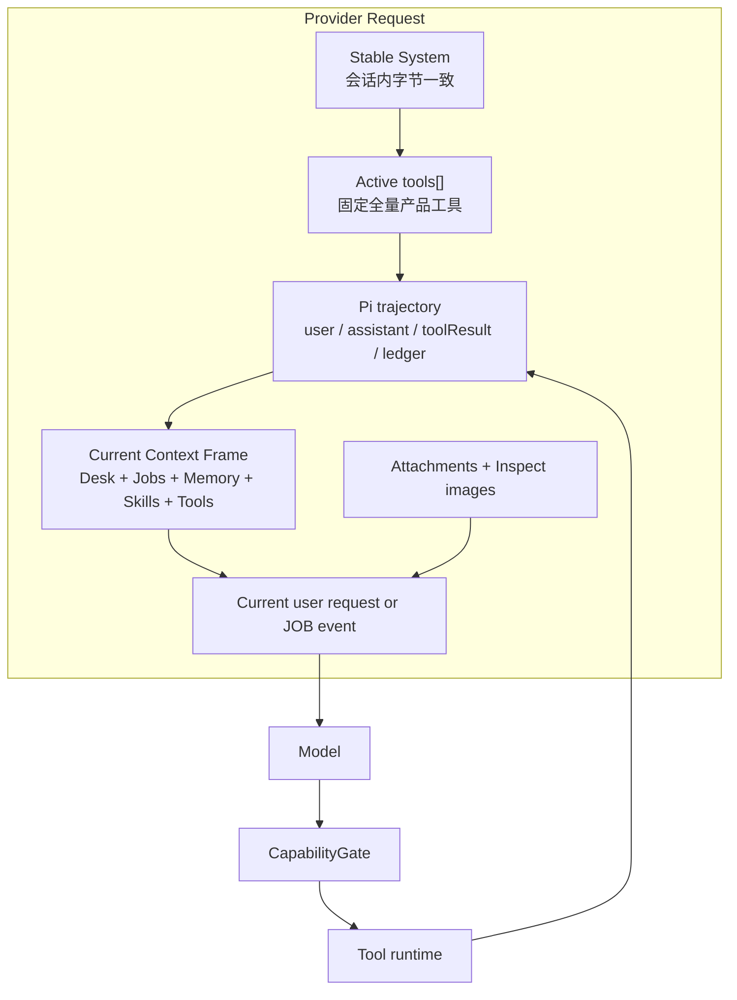
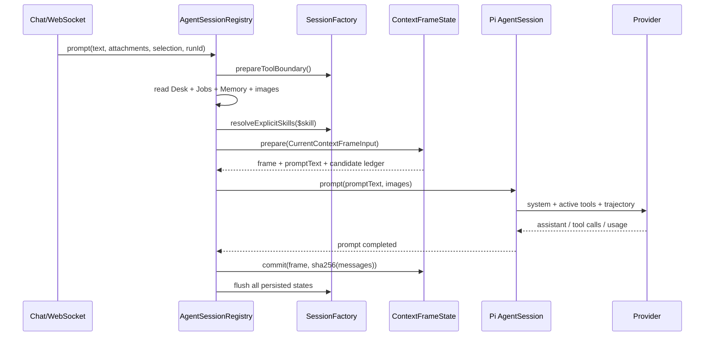

# Agent 上下文管理模块：当前实现

**状态：** 已落地实现参考
**最后核对：** 2026-08-12
**适用范围：** Designer 对话、工具跟进、Skill 加载、Desk/Jobs/Memory 当前状态、Pi compaction、异步 JOB wake 与 Prompt Cache 观测
**代码入口：** `apps/server/src/agent/session-registry.ts`、`apps/server/src/agent/session-factory.ts`

这份文档说明砌间 Agent 当前实际运行的上下文管理模块。它回答三个问题：模型每次到底看见什么；状态如何跨轮、跨进程和压缩后恢复；系统如何在保留能力的同时提高 Prompt Cache 命中率。

设计依据与演进过程见 [Agent 上下文、工具与 Skills 高缓存架构](agent-context-kv-cache-architecture.md)。桌面投影细节见 [Agent 桌面上下文装配](agent-desk-context-assembly.md)。本文以当前代码为准，不描述尚未实现的目标接口。

---

## 1. 模块结论

当前上下文不是每轮重新拼一份巨大提示词，而是五层共同组成：

1. **Stable System 稳定系统提示词**：会话创建时确定，整个 Pi session 生命周期内保持字节一致。
2. **Provider Tool View**：全部产品工具在 session 创建时一次性固定激活（固定全量超集），运行路径不再改变 active set；`search_tools` 仅提供能力说明。
3. **Append-only Trajectory**：Pi 持久化的 user、assistant、toolResult 和 compaction 消息轨迹。
4. **Current Context Frame**：每轮由代码生成的当前 Desk、Jobs、Memory、Skills、Tools 与执行模式，按 `full / delta / unchanged` 追加到轨迹末尾。
5. **Images**：本轮附件与 Inspect 原图，和文本中的 image index 对齐，不写进 Stable System。

缓存优化的核心不是减少模型能力，而是让变化尽量发生在请求尾部，并让相同状态用短小、确定的 `unchanged` 表达。



---

## 2. 组件边界


| 组件                         | 当前职责                                                      | 持久状态                                |
| -------------------------- | --------------------------------------------------------- | ----------------------------------- |
| `AgentSessionRegistry`     | 一轮请求的总编排；读取 Desk/Jobs/Memory；装配图片、Skill 和 Frame           | 进程内 session map、busy run、idle timer |
| `SessionFactory`           | 创建和恢复 Pi session；注册工具；挂载状态对象、事件采集和 compaction 扩展          | 通过下列状态组件落盘                          |
| `deskSystemPrompt`         | 生成稳定 System Prompt，声明身份、状态协议、工具纪律和信任边界                    | 创建 Pi session 时固定                   |
| `CurrentContextFrameState` | 生成 canonical frame；计算状态差异；提交 revision ledger；处理 resync    | `context-ledger.json`               |
| `DeskAliasRegistry`        | 为项目内 artifact 分配稳定 `A01…` 别名                              | 项目级 `desk-aliases.json`             |
| `SessionToolState`         | 维护固定工具集（Kernel = Registry）、registry revision 和 `toolEpoch` | `tool-state.json`                   |
| `SessionSkillState`        | 维护 Skill catalog revision、loaded revision 与 emit-once 状态  | `skill-state.json`                  |
| `ContextResourceStore`     | 保存被预算层截断的完整文本，按内容哈希分页恢复                                   | `resources/<sha256>.json`           |
| `ToolBatchLedger`          | Pi compaction 时保留目标、结论与已经闭合的工具事实                          | Pi 隐藏 custom message                |
| `CapabilityGate`           | 根据当前 designer/wake 模式判断工具是否允许执行                           | 无；使用 run-scoped `TurnContext`       |
| `CacheContract`            | 会话内锁定 System hash，并生成请求指纹用于诊断                             | 进程内 WeakMap + trace/log             |
| `usage-metrics`            | 读取 Provider usage，计算 cache hit 与 effective reuse          | 日志和 trace                           |


`session-registry.ts` 负责顺序，不拥有各领域状态的内部规则。Desk 投影、差异计算、工具工作集、Skill emit-once、权限和结果预算都有独立实现与测试。

---

## 3. 一轮请求的完整数据流

### 3.1 获取或恢复 Session

系统按 `(projectId, threadId)` 维护一个 Pi `AgentSession`。同一个 key 的并发获取共享同一个创建 Promise，避免重复创建会话。

创建时完成以下工作：

1. 用 `deskSystemPrompt()` 生成 Stable System。
2. 关闭 Pi 默认 extensions、skills、prompt templates 和 context files，避免外部文件隐式污染上下文。
3. 用 `SessionManager.continueRecent()` 恢复该线程的 Pi 轨迹。
4. 注册全部产品工具定义，并一次性固定激活全量（Kernel = Registry）。
5. 打开 Context、Tool、Skill、Resource 和 Desk Alias 状态。
6. 校验持久化 Context Ledger 的 trajectory anchor 是否仍对应当前 Pi 历史。

Session 空闲 30 分钟后从内存释放。再次使用时从 Pi 历史和四类 JSON 状态恢复，不依赖旧进程内对象。

### 3.2 建立本轮执行上下文

`AgentSessionRegistry.prompt()` 为每次 run 创建不可变 `TurnContext`：

```ts
type TurnContext = {
  projectId: string;
  threadId: string;
  runId: string;
  source: "interactive" | "job_event";
  mode: "designer" | "wake";
  authority: "user_explicit" | "system_event";
  policyRevision: string;
  selectedArtifactIds: readonly string[];
};
```

它通过 `AsyncLocalStorage` 绑定到当前异步调用链。并发 thread 或并发 run 不会读到彼此的权限与选择状态。

### 3.3 请求边界的工具集合校验

发送模型请求前，`prepareToolBoundary()` 比较 Pi 当前 active tools 与 `SessionToolState.desiredActiveTools()`（固定全量产品工具）：

- 一致（正常路径）：保持不变。
- 不一致（异常漂移）：收敛回固定全量集并推进 `toolEpoch`，形成明确、可观测的请求边界。

运行路径不存在正常触发的集合替换——`setActiveToolsByName` 只在 session 创建时调用一次（它同时改变 provider-visible `tools[]` 并让 pi 按 active 集重建 system prompt，详见 §7）。

### 3.4 读取并蒸馏当前状态

系统并行或顺序读取当前真源：

- Desk snapshot、文件原名和项目级稳定 alias；
- 最近可见 Jobs；
- Project Memory revision、条目和 compiled context；
- 当前附件；
- 选中和唯一指代对象的 Inspect 图片；
- 用户显式写出的 `$skill-id`。

Desk snapshot 先编译为 Survey、Focus、Resolution、Inspect plan 和 manifest。Caption 只为 core focus 做最多 80ms 的缓存预加载；失败或超时直接降级为空，不阻塞对话。

### 3.5 Prepare、Prompt、Commit

Frame 使用两阶段提交：

1. `prepare(input)` 根据最后一次**已经提交**的 Ledger 生成 frame 和下一状态，但不修改 Ledger。
2. `session.prompt(frame.promptText, images)` 执行真实模型调用和工具循环。
3. 只有 prompt 成功后才执行 `commit(prepared, trajectoryAnchor)`。
4. finally 中 flush Context、Tool、Skill 和 Alias 写入队列。

因此，模型请求失败不会让 Ledger 假装某个 frame 已进入轨迹。显式 Skill 若已准备注入但 prompt 失败，会触发 Skill resync，使下一次请求重新发正文。



---

## 4. Provider 请求与消息格式

### 4.1 逻辑结构

```text
Provider Request
├── system: deskSystemPrompt(provider, model)
├── tools[]: 当前 active tool definitions
└── messages[]
    ├── 历史 user / assistant / toolResult
    ├── 可选 compaction summary
    ├── 可选隐藏 TOOL_BATCH_LEDGER
    └── 当前 user message
        ├── <system_context_frame ...>...</system_context_frame>
        └── <user_request source="interactive|event">...</user_request>
            + 本轮 images[]
```

Pi 当前公开 prompt API 接受一条 user message，所以 Frame 和 Request 编译在同一条消息中。Frame 总是在前，真正的用户请求或 JOB event 总是在最后。

### 4.2 Current Context Frame 示例

下面是格式示例，字段值按当轮状态生成：

```xml
<system_context_frame version="1" current="true" seq="42" context_epoch="..." trajectory_epoch="2">
  <turn source="interactive" mode="designer" authority="user_explicit" />
  <desk revision="desk-91" state="delta" from_revision="desk-90">
    <added id="artifact-8" value="{...canonical JSON...}" />
    <updated id="artifact-3" value="{...canonical JSON...}" />
    <removed id="artifact-5" />
  </desk>
  <request_context source="system_assembled">
    [选中]
    - A03 artifact-3

    [FOCUS]
    - core A03 artifact-3

    [INSPECT]
    - image_1 = A03 artifact-3
  </request_context>
  <jobs revision="..." state="unchanged" />
  <memory revision="12" state="unchanged" />
  <skills loaded="design-language@sha256:..." reload_required="" />
  <tools epoch="3" active="search_tools,look_at,look_at_desk,read_context_resource,search_skills,load_skill,generate_from_desk,replace_on_desk,text_to_image_on_desk,remove_from_desk,get_task,inspect_project_memory,search_project_memory,record_project_memory,forget_project_memory" />
  <execution policy_revision="capability-gate-v1" />
</system_context_frame>

<user_request source="interactive">
请基于 A03 再做一个更克制的方向。
</user_request>
```

Frame 本身是系统组装的数据。用户原文、附件名、Caption、Skill 正文和工具返回仍按各自信任级别处理，不因为进入 XML 标签就升级为系统指令。

### 4.3 Frame 字段


| 字段                 | 含义                                               |
| ------------------ | ------------------------------------------------ |
| `version`          | Frame schema 版本，当前为 `1`                          |
| `seq`              | 当前 trajectory 内单调递增的已提交 frame 序号                 |
| `context_epoch`    | `sha256({ systemPrompt, skillCatalogRevision })` |
| `trajectory_epoch` | compaction、轨迹失配或强制重同步时递增                         |
| `turn`             | 本轮来源、模式和权限来源                                     |
| `desk`             | 当前桌面 full、delta 或 unchanged                      |
| `request_context`  | 每轮都可变化的选中、指代、Focus 与 Inspect 索引                  |
| `jobs`             | 可见 Job 的 full、delta 或 unchanged                  |
| `memory`           | Project Memory 的 full、delta 或 unchanged          |
| `skills`           | 已加载 revision、需要重发的 revision 和本轮首次注入正文            |
| `tools`            | 当前 tool epoch 与请求开始时的 active tool names          |
| `execution`        | Capability policy revision                       |


### 4.4 `full / delta / unchanged` 规则


| Domain | `full`                                                         | `delta`                                 | `unchanged`                       |
| ------ | -------------------------------------------------------------- | --------------------------------------- | --------------------------------- |
| Desk   | 首帧；当前或上轮 revision 为 `unknown`；resync 后；编码后的 delta 超过 12,000 字符 | 已有可靠 baseline、manifest 发生变化且 delta 未超预算 | revision 与 canonical manifest 都相同 |
| Jobs   | 首帧                                                             | revision 或 entries 变化                   | revision 与 canonical entries 都相同  |
| Memory | 首帧；任一侧为 `disabled/unavailable` 等非数字 revision                   | 两侧都是数字 revision 且 entries 变化            | revision 与 canonical entries 都相同  |


Delta 的 key 按字典序输出，操作只有 `added / updated / removed`。对象比较使用 canonical JSON；对象属性顺序不影响差异判断。

`request_context` 不参与 unchanged 折叠。即使桌面主体不变，本轮选择、Focus、指代和 Inspect 仍会直接提供给模型。

### 4.5 确定性序列化

当前实现采用以下规则降低无意义前缀变化：

- Record key 和 delta id 按字典序输出；
- 工具按固定 registry 顺序恢复；
- Skill id 按字典序输出；
- 换行统一为 `\n`，文本首尾 trim；
- XML 文本与属性分别转义；
- hash 前使用 canonical JSON；
- Desk alias 持久化，不因桌面排序、删除或 session resume 重编号。

---

## 5. Context Ledger、Epoch 与恢复

### 5.1 Ledger 内容

每个 thread 的 `context-ledger.json` 保存：

```ts
type PersistedContextLedger = {
  version: 1;
  contextEpoch: string;
  trajectoryEpoch: number;
  nextFrameSeq: number;
  lastTrajectoryAnchor?: string;
  lastDeskRevision?: string;
  lastDeskManifest: Record<string, DeskManifestEntry>;
  lastJobsRevision?: string;
  lastJobsEntries: Record<string, JobFrameEntry>;
  lastMemoryRevision?: string;
  lastMemoryEntries: Record<string, MemoryFrameEntry>;
};
```

Ledger 是生成下一轮 delta 的 baseline，不是业务真源。Desk、Job Store 和 Project Memory 仍然拥有当前业务事实。

### 5.2 三种序号各自解决什么


| 序号                | 变化条件                                         | 作用                          |
| ----------------- | -------------------------------------------- | --------------------------- |
| `contextEpoch`    | Stable System 或 Skill catalog revision 改变    | 旧 Frame baseline 整体失效       |
| `trajectoryEpoch` | compaction、resume 轨迹失配、显式 resync             | 提醒模型当前轨迹已进入新的状态同步阶段         |
| `toolEpoch`       | Tool registry schema 变化（或异常漂移后的边界收敛） | 标记 Provider Tool View 的缓存边界 |


### 5.3 Resume 校验

每次成功提交 Frame 后，系统保存 `sha256(session.messages)` 为 trajectory anchor。Session 重建时再次计算当前 Pi messages hash：

- 相同：继续使用上次 Desk/Jobs/Memory baseline 生成 delta。
- 不同：清空这些 baseline、递增 `trajectoryEpoch`，下一轮发送受预算保护的 full resync。

这一机制处理进程重启、Pi 历史变化和 Ledger/trajectory 不同步。它避免根据自然语言历史猜测当前状态。

### 5.4 原子持久化

Context、Tool、Skill 与 Alias 状态各自使用串行 Promise write chain。写入过程先生成同目录临时文件，再原子 rename 到目标文件；`prompt()` 的 finally 会等待所有 write chain 完成。

---

## 6. Desk 当前状态管理

### 6.1 从 Snapshot 到 Manifest

Desk assembler 只读取 `desk_state.objects ∩ artifacts`。不在桌上的历史 artifact 不进入当前目录。

每个 manifest entry 包含：

- artifact id 与稳定 alias；
- type、display label 与 lifecycle；
- grid、x、y；
- file id；
- incoming/outgoing connections。

Survey 是当前桌面主体；Selection、Resolution、Focus 和 Inspect 属于 request-scoped context。这样，桌面主体 unchanged 时仍能准确表达“这一轮正在看哪张图”。

### 6.2 稳定 Alias

`DeskAliasRegistry` 在 artifact 首次出现时分配 `A01、A02…`：

- 同项目不同 thread 共用；
- 删除对象后 alias 不回收；
- 新对象继续递增；
- resume 后保持一致；
- 工具参数仍使用真实 artifact id，alias 主要服务人和模型指认。

### 6.3 Focus 与 Inspect

Focus 集合来自：

- 本轮有效 selection；
- 唯一指代消解结果；
- 一跳显式连接对象，最多额外 12 个。

Inspect 只加载 ready 且有 file 的图片，最多 4 张。附件与选中图片按 file id 去重。未加载到原图的对象会进入 skipped reason，模型不能把 Caption 当成已经看见像素。

### 6.4 大桌 full/resync 硬预算

Desk 首帧、full resync 或超大 delta 提升为 full 后，XML 转义正文上限为 **12,000 字符**。普通 delta 在渲染前也会检查长度；超过该值就改发受预算保护的 full，避免大量 updated entries 形成失控后缀。Full 正文超过上限时：

1. 原始完整 Desk 文本写入 `ContextResourceStore`。
2. 内联正文改为 compact object directory。
3. Focus、hop1 和 Inspect 对象优先保留。
4. 其余对象按 alias/id 确定性排序，能放多少放多少。
5. 输出 `[DESK_FULL_TRUNCATED]`、`resource_ref`、`next_cursor=0` 与 omitted count。

硬预算只约束 full Desk body。每轮 `request_context` 中的 Focus/Inspect 仍直接保留。Resource Store 不可用时仍遵守 12,000 字符上限，并明确 `resource_status=unavailable`。

---

## 7. 工具上下文：固定全量工具集

### 7.1 三个集合

工具管理需要区分三个概念：


| 集合                  | 内容                                 | Provider 是否看见      |
| ------------------- | ---------------------------------- | ------------------ |
| Registry            | `createDeskTools()` 创建的全部工具定义，顺序固定 | 是，全部进入每次请求 |
| Kernel              | 与 Registry 相同：固定全量产品工具          | 是                  |
| Session Working Set | 已移除（原低频工具有界工作集，见 §18）       | —                 |


固定全量工具集在创建 Pi session 时作为 allowlist 和 custom definitions 注册并一次激活；此后运行路径不再调用 `setActiveToolsByName`。原因：SDK 的 `setActiveToolsByName()` 会同时改写 provider-visible `tools[]` 并按 active 集重建 system prompt（拼接各工具的 `promptSnippet`/`promptGuidelines`），任何 mid-run 激活都会让缓存前缀从 system 段起整体失配（基准 r01 断点 #2：4 次全量冷读合计 182,670 tokens，均与 `toolEpoch` 递增对齐）。

### 7.2 能力查询流程

```text
模型不确定该用哪个工具
  → 调用 search_tools(query)
  → 在静态 TOOL_CATALOG 中按中英文关键词匹配
  → 返回能力名称与用法说明（纯推荐，全部工具始终可用）
  → 模型直接调用对应业务工具
```

search_tools 不触碰 session 与 active set；执行权限始终由 CapabilityGate 按 TurnContext 决策（schema 可见性不承担安全职责）。

### 7.3 Tool registry 变更

`registryRevision` 对所有工具的 name、description、parameters 与 constrained sampling 做 hash：

- revision 相同：恢复 last active tools（固定全量集）。
- revision 变化：推进 `toolEpoch`，按新 Registry 全量预热。

这会产生一次明确的缓存 epoch 切换，同时保证旧 schema 不会被错误恢复。

---

## 8. Skills 渐进披露与缓存

### 8.1 Catalog

Skill 位于 `apps/server/src/agent/skills/<id>/SKILL.md`，也可用 `SKILLS_DIR` 指定可信根目录。Catalog 只接受符合 `[a-z0-9-]+` 的 id，并通过 realpath 保证 `SKILL.md` 位于根目录内。

Catalog metadata 包含 id、name、title、description、summary、revision 和 baseDir。Revision 来自完整 `SKILL.md` 内容 hash；catalog revision 来自所有 `{id, revision}`。

当前 catalog snapshot 在进程内缓存。运行中直接修改 Skill 文件后，需要重启服务才能建立新 snapshot。

当前运行时只读取 `SKILL.md` metadata 和正文，不自动执行 scripts、解析 `allowed-tools` 或递归加载引用资源。`baseDir` 作为来源与信任边界信息随加载结果提供。

### 8.2 两条加载路径

**自然语言发现：**

```text
search_skills(query) 只返回 metadata
  → load_skill(skill_id) 首次返回正文
```

**用户显式指定：**

```text
用户输入：请用 $design-language 检查这张图
  → resolver 提取 skill id
  → 本轮 Current Context Frame 的 <skills> 中直接注入正文
```

两条路径共享同一个 `SessionSkillState`，因此同一 revision 在同一 trajectory 中只发送一次正文。

### 8.3 Emit-once 状态

Skill state 分开记录：

- `loadedRevisions`：会话已经加载过哪些 revision；
- `emittedRevisions`：哪些正文仍存在于当前 trajectory；
- `trajectoryEpoch`：Skill 的重发阶段。

重复加载同一 revision 时，工具只返回小型 `cache: already_loaded` 标记。Compaction 或 trajectory mismatch 会保留 loaded revisions、清空 emitted revisions；Frame 的 `reload_required` 随后标记需要重新发送的 Skill。

Skill 正文最多 6,000 字符，并标记为 `untrusted_domain_recipe`。它可以提供领域工作法，不能修改系统身份、工具 allowlist 或 CapabilityGate 权限。

---

## 9. 工具结果预算与 Context Resource Store

### 9.1 统一预算

每个工具定义最终都会经过 `budgetToolDefinition()` 包装。文本预算按结果类型划分：


| 类别         | 工具示例                     | 最大内联文本   |
| ---------- | ------------------------ | --------: |
| control    | 生图受理、删除、记忆写入等            | 1,500 字符 |
| retrieval  | Memory/Skill 检索、资源分页     | 6,000 字符 |
| perception | `look_at`、`look_at_desk` | 4,000 字符 |
| error      | 任意失败结果                   | 2,000 字符 |


小结果原样保留，只附加 `result_budget` 指标。大结果内联预览和 `[TOOL_RESULT_TRUNCATED]`，完整文本写入 Resource Store。

图像块不因文本预算被压缩或重编码；指标会单独记录 `image_count` 和 base64 字符数。

### 9.2 内容寻址资源

Resource ref 格式：

```text
ctxres:sha256:<64 hex chars>
```

Hash 同时覆盖 source tool name 和完整 text。相同来源与相同正文得到相同 ref。读取时重新校验 payload hash，并且只接受严格 ref 正则和十进制 cursor，因此不能借 ref 做路径穿越。

`read_context_resource` 是 Kernel 工具：

- 默认每页 5,000 字符；
- 模型单次最多请求 5,500 字符；
- Store 底层硬上限 6,000 字符；
- 返回确定性的 `next_cursor`，没有 next cursor 表示结束。

---

## 10. Pi Compaction 后的上下文恢复

Pi compaction 会缩短旧轨迹，但普通摘要容易丢失 task id、artifact id、失败状态和 resource ref。当前实现增加 `ToolBatchLedger` 扩展。

### 10.1 Ledger 保留内容

Compaction 前，系统从待压缩消息中提取：

- 最近用户目标，最多 6 条；
- 最近无工具调用的 assistant outcomes，最多 6 条；
- 已闭合工具批次的 tool name、status；
- artifact/task/file/skill ids；
- Memory stable keys、revisions、resource refs 和 error code。

只有一个 assistant 工具批次中的**所有 tool call 都有位于其后的 toolResult**，该批次才会进入 Ledger。开放批次整体不纳入；孤立结果只计数，不伪造调用事实。

Ledger 最多保留最近 24 个 batch，渲染文本硬上限 10,000 字符。它作为隐藏、持久的 Pi custom message 写回轨迹。

### 10.2 Compaction 后第一轮

收到成功的 `compaction_end` 后：

1. Context `trajectoryEpoch` 递增并清除 Desk/Jobs/Memory baseline。
2. Skill emitted revisions 清空。
3. 下一轮 Current Context Frame 发送受预算保护的 full state。
4. 已加载 Skill 在再次需要时确定性重发。
5. 历史工具事实由 `[TOOL_BATCH_LEDGER]` 提供，当前 Frame 对已经变化的事实拥有更高当前性。

---

## 11. JOB wake 与执行权限

异步图像任务完成后，`JobWakeService` 会把同一 thread 的短窗终态合并为一条系统事件。Thread 正忙时事件排队，当前 run 结束后再 drain。

Wake 仍走与用户对话相同的 Context Frame 管道：

```text
source = job_event
mode = wake
authority = system_event
```

System Prompt 和工具 schema 不需要为 wake 改写。执行权限由 `CapabilityGate` 在工具真正执行前判断。

Wake 允许的只读工具当前为：

```text
look_at
look_at_desk
get_task
inspect_project_memory
search_project_memory
load_skill
read_context_resource
```

其他工具返回结构化 `WAKE_READ_ONLY / POLICY_DENIED`，不会进入业务实现。这样，系统事件可以读取并汇报结果，但不能自行开启新的生图、删除或记忆写入副作用。

---

## 12. 持久化目录

当前项目默认目录：

```text
data/agent-sessions/<projectId>/
├── desk-aliases.json                 # 项目级，跨 thread 共用
└── <threadId>/
    ├── <Pi SessionManager files>     # Pi 轨迹
    ├── context-ledger.json           # Frame baseline + epochs + anchor
    ├── tool-state.json               # registry、toolEpoch、last active tools
    ├── skill-state.json              # catalog、loaded/emitted revisions
    └── resources/
        └── <sha256>.json             # 被截断的完整上下文/工具文本
```

所有状态文件都是派生运行状态。业务真源仍在 Desk、Artifact、Job 和 Project Memory 存储中。

---

## 13. Cache Contract 与观测

### 13.1 当前运行时硬约束

`CacheContract.observe()` 当前只对一个条件做运行时强制：**同一 AgentSession 内 System Prompt hash 不能变化**。检测到变化会直接抛错。

其余维度通过指纹、状态机和测试观测：

```ts
type CacheFingerprint = {
  systemSha256: string;
  toolsSha256: string;
  historyPrefixSha256: string;
  activeToolCount: number;
  historyMessageCount: number;
  toolEpoch: number;
  workingSetSha256: string;
  workingSetSize: number;
  frameSha256: string;
  trajectoryEpoch: number;
};
```

`turn_start` 时会按 active tool 的实际顺序和 schema 计算 `toolsSha256`，按 Pi messages 计算 `historyPrefixSha256`，并记录当前 Frame hash 和 Desk full budget 指标。

### 13.2 Usage 口径

数据来自 Pi `message_end` 的 Provider usage：

```text
read_hit_rate = cacheRead / (input + cacheRead)
effective_reuse_rate = cacheRead / (input + cacheRead + cacheWrite)
```

聚合时先对 token 求和再相除，不能对每轮百分比做简单平均。

设置环境变量后可输出一行 JSON 日志：

```bash
AGENT_LOG_USAGE=1 npm run dev:server
```

日志包含 project、thread、run、model、单轮 usage、run aggregate 和 cache fingerprint。相同字段也进入 tracing span。

### 13.3 逐轮模型与工具观测

每个 Pi `turn_start` 使用 run 内从 0 递增的 `turnIndex`。`message_end` 将 Provider 返回的 `input`、`output`、`cacheRead`、`cacheWrite`、`totalTokens` 持久化到 `chat_model_turns`，并在 LangSmith 中产生独立 `model.turn.<index>` span。

每个 `chat_tool_calls` 记录：

- 所属 `turnIndex`；
- 参数和结果的 JSON 字符数、UTF-8 字节数；
- 发出该工具调用的模型轮次 prompt token；
- 工具结果进入轨迹后，下一次 Provider 请求的 prompt token 与差值；
- 并行工具的 `sharedBatchSize`。

prompt token 口径为 `input + cacheRead + cacheWrite`。多个并行工具的结果在同一次上下文转换中进入下一轮，因此共享同一个前后 token 差值；系统保留这一事实，不伪造单工具 token 分摊。观测链不采集或估算金额。

### 13.4 真实缓存基准

```bash
# 文本、Skill、工具、大桌、Desk delta、真实生图与 JOB wake
npm run benchmark:cache

# 重复整个集合，观察 Provider 路由方差
npm run benchmark:cache -- --repeat=3
```

2026-08-12 的最终规范集合包含 95 次真实模型调用：54 个 eligible 轮次 token 加权命中率为 **93.00%**，53/54 轮达到 90%。短时全流量值为 84.08%。另一次完整重复测量为 89.66%，说明应用层前缀已经稳定，但 Provider cache affinity 仍会带来跨次波动。

完整口径和原始结果见 [Agent Prompt Cache Benchmark](../benchmarks/agent-cache/README.md)。

---

## 14. 故障与降级语义


| 故障                             | 当前行为                                                    | 对话是否继续        |
| ------------------------------ | ------------------------------------------------------- | -------------: |
| Desk snapshot 失败               | `revision=unknown`，输出“桌面状态暂不可用”                         | 是             |
| Memory 读取失败                    | `revision=unavailable` + `[PROJECT_MEMORY unavailable]` | 是             |
| Caption 超时/失败                  | 不注入 Caption                                             | 是             |
| Inspect 图片加载失败                 | 标记 skipped，不伪造像素观察                                      | 是             |
| Resource Store 写失败             | 保留有界预览，标记 `resource_status=unavailable`                 | 是             |
| Context/Tool/Skill 状态 flush 失败 | 记录 warning；下次根据持久状态恢复或 resync                           | 是             |
| Prompt 失败                      | 不提交 Frame；显式 Skill 标记 resync                            | 否，本轮失败        |
| Resume trajectory hash 不一致     | 清除 delta baseline，下一轮 full resync                       | 是             |
| Tool registry revision 改变      | 推进 tool epoch，按新 Registry 全量预热                            | 是             |
| Skill catalog revision 改变      | 开启新 Skill trajectory，重新按需 emit                          | 是             |
| Wake 调用写工具                     | Gate 返回 `POLICY_DENIED`（正常工具返回，不污染 run 终态）       | 是，模型按原因调整    |
| Provider 无 cache usage signal  | Benchmark fail-closed，不把 0 当命中                          | 对话可继续，SLO 不通过 |


---

## 15. 当前不变式

维护上下文模块时，应保持以下可测试性质：

1. 同一 session 的 System Prompt 字节不变。
2. 已经进入 Pi trajectory 的历史消息不由应用层重写。
3. Frame 永远位于本轮 `user_request` 前面，用户请求位于消息末尾。
4. Frame 只在 prompt 成功后 commit。
5. `seq` 单调递增；compaction/resume mismatch 推进 `trajectoryEpoch`。
6. Desk/Jobs/Memory 的 delta 由结构化 baseline 计算，不让 LLM 从历史文本猜。
7. Request-scoped Selection、Focus 和 Inspect 不因 Desk unchanged 被省略。
8. Tool Registry 顺序稳定；`setActiveToolsByName` 只在 session 创建时调用一次，运行路径不替换 active set。
9. search_tools 纯推荐：查询能力说明不触碰 session 与 active set。
10. 同一 Skill revision 在同一 trajectory 中只发一次正文。
11. 长文本有明确预算、截断标记和可验证的 resource ref。
12. Compaction Ledger 只保留闭合工具批次。
13. Wake 的写操作由执行 Gate 拦截，而不是依赖提示词自觉。
14. Cache 指标使用 token 加权公式并保留 cold/warmup/eligible cohort 区别。

---

## 16. 修改模块时如何验证

### 16.1 按领域运行测试

```bash
# Current Context Frame、Ledger、资源化与大桌预算
npx vitest run apps/server/src/agent/context

# 工具工作集、发现、结果预算与 Skill 工具
npx vitest run \
  apps/server/src/agent/tools/session-tool-state.test.ts \
  apps/server/src/agent/tools/tool-activation.test.ts \
  apps/server/src/agent/tools/search-tools.test.ts \
  apps/server/src/agent/tools/result-budget.test.ts \
  apps/server/src/agent/tools/result-budget-wrapper.test.ts \
  apps/server/src/agent/tools/skills.test.ts

# Skill catalog、resolver 与 emit-once
npx vitest run apps/server/src/agent/skills

# System 稳定性、权限和 cache fingerprint
npx vitest run \
  apps/server/src/agent/session-registry.test.ts \
  apps/server/src/agent/cache-contract.test.ts \
  apps/server/src/agent/capability-gate.test.ts
```

### 16.2 全量验收

```bash
npm test
npm run build
npm run benchmark:cache -- --repeat=3
```

单元测试证明序列化和状态机确定；真实 benchmark 才能证明 Provider 实际返回 cacheRead。两者不能互相替代。

---

## 17. 扩展指南

### 17.1 新增 Current Context Domain

新增类似 Desk/Jobs/Memory 的状态时：

1. 从业务真源读取结构化 snapshot。
2. 定义稳定 revision 和 canonical entry schema。
3. 在 Ledger 中保存上一已提交 baseline。
4. 明确 full、delta、unchanged 和 unavailable 转换。
5. 把每轮临时信息放进 request-scoped 区域，不污染持久 domain state。
6. 为首帧、unchanged、增删改、unavailable、resume 和 compaction 写测试。
7. 若 full 可能很大，同时定义硬预算和 Resource Store 恢复路径。

### 17.2 新增工具

1. 在 `createDeskTools()` 的确定位置注册定义（注册即进入固定全量 Kernel，直接常驻 provider-visible `tools[]`）。
2. 在 `TOOL_CATALOG` 增加检索 metadata（search_tools 纯推荐用）。
3. 在 `CapabilityGate` 明确 wake 权限。
4. 在 Result Budget 分类中确认文本上限。
5. 验证 registry revision 变化会开启新的 tool epoch。
6. 运行真实工具链缓存场景（memory_tool_chain）。

### 17.3 新增 Skill

1. 新建 `<skillsRoot>/<skill-id>/SKILL.md`。
2. Frontmatter 的 `name` 必须等于目录 id，并提供 `description`。
3. 正文应在 `SKILL.md` 内自包含；当前运行时不会自动读取 references 或执行 scripts。
4. 验证 `search_skills` metadata、`load_skill` 正文与显式 `$skill-id`。
5. 修改正文 revision 后，重启服务以刷新当前进程 catalog snapshot。
6. 验证旧 revision 不复用，compaction 后可以确定性重发。

---

## 18. 已知边界与权衡

- Provider-visible `tools[]` 为固定全量产品工具：session 创建时一次激活，运行路径不再替换；只有 registry 契约变更会形成显式 tool epoch。原"Kernel + 有界 Working Set"发现式激活已移除（基准 r01 断点 #2：`setActiveToolsByName` 同时改写 tools[] 与 system prompt 导致缓存前缀整体失配）。未来出现真低频能力时计划以 `search_capabilities`/`invoke_capability` 带外引入，不进 SDK 注册表。
- `CacheContract` 当前硬锁 System，tools/history/frame 依靠指纹、状态机与测试发现漂移。它们尚未全部升级为请求前 fail-fast 断言。
- 大桌 12,000 字符限制约束 full Desk body，不代表整条 user message 的总字符上限。
- Tool/Skill catalog 是进程内 snapshot，运行中编辑定义需要重启才会形成新 revision。
- Skill 渐进披露当前落地到 metadata → `SKILL.md` body；references/scripts 层尚未进入产品运行时。
- Content Resource Store 保存完整文本并按 hash 去重，目前没有独立 TTL/GC；它跟随 session 目录生命周期管理。
- 应用层可以保证可复用前缀的确定性，不能保证 Provider TTL、节点路由和 cache affinity。跨次稳定 90% 仍需重复基准与生产观测。

---

## 19. 源码导航


| 主题                             | 文件                                                                                 |
| ------------------------------ | ---------------------------------------------------------------------------------- |
| 一轮请求总装配                        | `apps/server/src/agent/session-registry.ts`                                        |
| Pi session 创建与事件订阅             | `apps/server/src/agent/session-factory.ts`                                         |
| Stable System                  | `apps/server/src/agent/system-prompt.ts`                                           |
| Current Context Frame + Ledger | `apps/server/src/agent/context/current-context-frame.ts`                           |
| Desk 装配                        | `apps/server/src/agent/desk-context.ts`                                            |
| 稳定 alias                       | `apps/server/src/agent/context/desk-alias-registry.ts`                             |
| 大桌 full 预算                     | `apps/server/src/agent/context/suffix-budgeter.ts`                                 |
| 内容资源                           | `apps/server/src/agent/context/resource-store.ts`                                  |
| Compaction Ledger              | `apps/server/src/agent/context/tool-batch-ledger.ts`                               |
| Tool registry 与 Kernel         | `apps/server/src/agent/tools/index.ts`、`tool-activation.ts`                        |
| Session Working Set            | `apps/server/src/agent/tools/session-tool-state.ts`                                |
| Tool discovery                 | `apps/server/src/agent/tools/search-tools.ts`                                      |
| Result Budget                  | `apps/server/src/agent/tools/result-budget.ts`、`result-budget-wrapper.ts`          |
| Skill catalog 与 emit-once      | `apps/server/src/agent/skills/`、`apps/server/src/agent/tools/skills.ts`            |
| 执行权限                           | `apps/server/src/agent/capability-gate.ts`                                         |
| Cache fingerprint              | `apps/server/src/agent/cache-contract.ts`                                          |
| Usage 指标                       | `apps/server/src/agent/usage-metrics.ts`                                           |
| JOB wake                       | `apps/server/src/agent/async-job/job-wake.ts`                                      |
| 真实缓存测试                         | `apps/server/src/agent/cache-benchmark*.ts`、`scripts/run-agent-cache-benchmark.ts` |


相关文档：

- [Agent 上下文、工具与 Skills 高缓存架构](agent-context-kv-cache-architecture.md)
- [Agent 桌面上下文装配](agent-desk-context-assembly.md)
- [项目设计记忆 V1](project-memory-v1.md)
- [Agent Prompt Cache Benchmark](../benchmarks/agent-cache/README.md)
