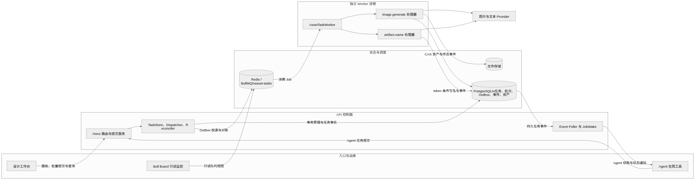
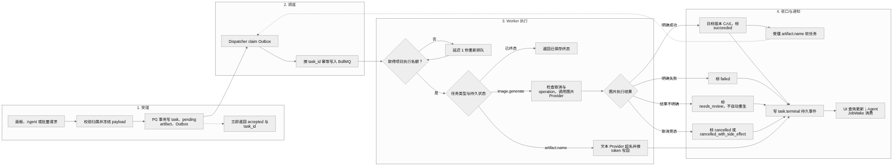
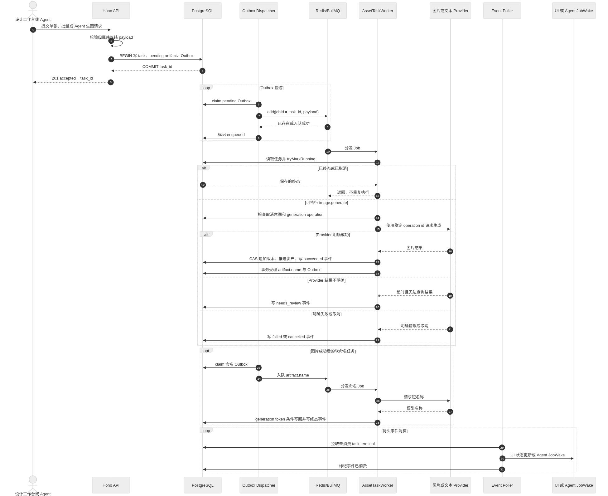

# 统一资产任务队列图

本文档以当前 BullMQ-only 实现为准，描述图片生成、批量生成和自动命名的运行时边界。

## 系统架构

可编辑源文件：

- [Mermaid 源文件](../diagrams/asset-task-architecture.mmd)
- [SVG](../diagrams/asset-task-architecture.svg)
- [Excalidraw 场景](../diagrams/asset-task-architecture.excalidraw)

核心边界：PostgreSQL 保存任务事实和审计，Redis/BullMQ 只保存可重建的调度投影；API 不执行图片 Provider，独立 Worker 执行图片与命名处理器。

## 任务流程

可编辑源文件：

- [Mermaid 源文件](../diagrams/asset-task-lifecycle.mmd)
- [SVG](../diagrams/asset-task-lifecycle.svg)
- [Excalidraw 场景](../diagrams/asset-task-lifecycle.excalidraw)

流程约束：

- `accepted` 只表示 PostgreSQL 受理成功，不表示图片已经生成。
- Dispatcher 使用稳定 `task_id` 入队，重复投递不会创建第二个逻辑任务。
- Worker 在外部调用前后检查取消意图，并以 CAS 收口资产版本。
- Provider 超时且无法查询结果时进入 `needs_review`，不自动再次生成。
- 图片成功后派生 `artifact.name` 软任务；命名失败不改变图片成功终态。

## 端到端时序

Mermaid 源文件：[asset-task-sequence.mmd](../diagrams/asset-task-sequence.mmd)

时序图覆盖一次图片任务、成功后的命名任务，以及持久化 `task.terminal` 事件被 UI/Agent JobWake 消费的路径。

说明：时序图可以渲染为 SVG/PNG，但 Mermaid 官方 Excalidraw 转换器目前只支持 flowchart，因此该图不提供 `.excalidraw` 编辑场景。
