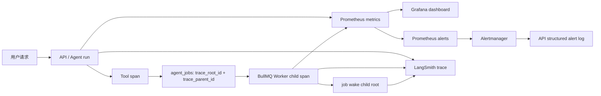

# Agent 运行监测与告警处置

本手册覆盖 API、Agent 对话、BullMQ 任务、独立 Worker、PostgreSQL、Redis、LangSmith 追踪与 prompt cache 观测。目标是让值守者在一个页面内回答四个问题：服务是否可用、请求在哪里变慢或失败、异步任务在哪里卡住、上下文缓存是否达标。

## 启动监测后台

先启动 API 和 Worker，再启动监测 profile：

```bash
docker compose up -d postgres redis
npm run dev:server
npm run dev:worker
docker compose --profile monitoring up -d
```

入口：

| 入口 | 地址 | 用途 |
|---|---|---|
| API liveness | `http://localhost:8787/health` | 进程存活 |
| API readiness | `http://localhost:8787/ready` | PostgreSQL、Redis、可用 Worker |
| API metrics | `http://localhost:8787/metrics` | HTTP、Agent、工具、缓存、队列、追踪指标 |
| Worker readiness | `http://localhost:9465/ready` | PostgreSQL、Redis、Worker 运行状态 |
| Worker metrics | `http://localhost:9465/metrics` | Worker 进程与任务指标 |
| Grafana | `http://localhost:3001/d/qijian-runtime` | 统一运行看板 |
| Prometheus | `http://localhost:9090` | 指标、PromQL 与告警状态 |
| Alertmanager | `http://localhost:9093` | 告警分组、静默与抑制 |
| Bull Board | `http://localhost:8787/admin/queues` | 队列任务详情 |

Grafana 与监测端口只绑定本机回环地址。本地 Grafana 默认开放匿名 Viewer，管理密码由 `GRAFANA_ADMIN_PASSWORD` 设置。部署到共享环境时，由统一身份认证和实际通知渠道接管。

## 观测模型



同一条业务链路的关联方式：

1. HTTP 请求使用 `x-request-id`；请求未携带时服务端生成 UUID，并回写响应头。
2. Agent root/tool span 在 LangSmith 中记录业务 ID。
3. 提交异步任务时，`agent_jobs.trace_root_id` 和 `trace_parent_id` 持久化当前父 span。
4. Worker 从数据库恢复父子关系，创建任务 child span；任务终态唤醒 Agent 时再创建 `agent.job_wake` child root。
5. 结合 `request_id`、`run_id`、`job_id`、`tool_call_id` 从结构化日志跳转到 LangSmith 和 Bull Board。

打开单次 Agent run 时，LangSmith 以 `model.turn.<index>` 展示每次 Provider 请求，工具 span 挂在发出调用的模型轮次下。本地 `chat_model_turns` 保留每轮 `input/output/cacheRead/cacheWrite`，`chat_tool_calls` 保留工具轮次、参数/结果尺寸和下一轮 prompt token 差值。并行工具共享一次上下文转换，通过 `sharedBatchSize` 显式标记。这条观测链不包含金额。

Grafana 用于聚合查看工具 p95 耗时、cache read/write token 速率和缓存命中率；单次 run 的精确轮次数据以 LangSmith 和本地两张事实表为准。

## 核心指标与目标

| 信号 | 指标 | 运行目标 |
|---|---|---|
| 可用性 | `up`、`qijian_subsystem_ready` | API、Worker 与必需依赖均为 1 |
| HTTP 错误 | `qijian_http_requests_total` | 5 分钟 5xx 比例低于 1% |
| Agent 结果 | `qijian_agent_runs_total` | 10 分钟 failed/interrupted 比例低于 5% |
| 队列时效 | `qijian_queue_oldest_waiting_seconds` | 最早等待任务低于 120 秒 |
| 指标采集 | `qijian_queue_snapshot_available` | 队列快照可用；失败时 `/metrics` 仍然可抓取 |
| 任务结果 | `qijian_tasks_total` | `needs_review` 每次都需处置 |
| 缓存复用 | `qijian_agent_model_tokens_total` | 稳态流量 30 分钟读命中率不低于 90% |
| 追踪可用性 | `qijian_trace_export_*_total` | drop/error 增量为 0 |
| 运行活性 | `qijian_agent_stale_runs_interrupted_total` | 看门狗不应经常介入 |

缓存读命中率固定为 `cacheRead / (input + cacheRead)`。告警只在 30 分钟内有足够 token 样本时评估，避免冷启动、极小样本产生误报。单轮分布同时由 `qijian_agent_cache_read_hit_ratio` 保留。

## 故障通用处置

1. 在 Grafana 确认异常开始时间和影响面。
2. 查看 `/ready` 确定是进程、PostgreSQL、Redis 还是 Worker 问题。
3. 用 `docker compose ps`、API/Worker JSON 日志和 Bull Board 定位首个失败点。
4. 若涉及 Agent 或任务，用 `run_id`/`job_id` 在 LangSmith 中打开完整父子链路。
5. 恢复后观察至告警 resolved，确认队列积压和错误率同时回落。

## QijianApiDown

- 确认 API 进程和 8787 端口：`curl -i http://localhost:8787/health`。
- 查看 API 启动日志，优先处理配置解析、数据库迁移和端口占用。
- 进程恢复后再检查 `/ready`，存活不代表可接流量。

## QijianWorkerDown

- 查看 `http://localhost:9465/ready` 与 Worker JSON 日志。
- 在 Bull Board 确认 active/waiting 任务数，再恢复 `npm run dev:worker`。
- API 的 `/ready` 会在 BullMQ 无可见 Worker 时返回 503。

## QijianDependencyNotReady

- 查看 `/ready` 中具体为 `postgres`、`redis` 还是 `worker`。
- PostgreSQL：`docker compose ps postgres`，检查连接数、磁盘和慢查询。
- Redis：`docker compose ps redis`，确认 ping、内存与持久化状态。

## QijianHttpErrorRateHigh

- 在 Grafana 缩小到异常时段，按 `route` 查询 `qijian_http_requests_total`。
- 从结构化日志取对应 `request_id`，定位业务错误码和下游依赖。
- 同时核对 Agent、队列和 readiness 面板，判断是单路由还是系统故障。

## QijianAgentErrorRateHigh

- 按 `source=interactive|job_wake` 分解 Agent 结果。
- 在 LangSmith 查看失败 root，检查模型、工具、压缩与上下文帧哪一层首先失败。
- 如果为 stale watchdog 中断，继续按 `QijianStaleAgentRun` 处置。

## QijianQueueBacklog

- 在 Bull Board 按任务 kind、attempt 和项目查看 waiting/delayed/failed。
- 确认 Worker 数、图像网关延迟以及 `TASK_PROJECT_IMAGE_CONCURRENCY` 是否与实际资源匹配。
- 按[Asset 任务队列手册](asset-task-queue.md)处理 outbox、重试和死信。

## QijianMetricsCollectionDegraded

- 检查 API `/ready` 中 Redis 状态和 `docker compose ps redis`。
- `/metrics` 会继续输出上次成功的队列快照，`qijian_queue_snapshot_available=0` 表示该快照已不新鲜。
- 恢复 Redis 后确认该指标回到 1，再使用队列数值做容量判断。

## QijianTaskNeedsReview

- 定位最近的 `needs_review` 任务与 Worker trace。
- 核对提供方是否已产生副作用，再由人决定重试或接管，避免重复生成资产。

## QijianCacheReuseLow

- 先确认是稳态连续轮次，排除冷启动、压缩边界和模型/供应商切换。
- 运行 `npm run benchmark:cache`，查看具体场景的 prefix divergence 与 turn hit rate。
- 在 LangSmith `model_usage` 和上下文 fingerprint 中定位发生变化的前缀层，对照 [Agent 上下文管理](../agent-context-management.md)。

## QijianTraceExportDegraded

- 查看 `trace_export_failed` 和 `trace_export_queue_dropped` 结构化日志。
- 检查 `LANGSMITH_ENDPOINT`、API key、出站网络与 LangSmith 状态。
- 追踪队列是有界的；Agent 业务请求继续执行，但本次追踪可能不完整。

## QijianStaleAgentRun

- 看门狗每 60 秒检查全局 `running` run，默认在 15 分钟无法完成时收敛为 interrupted。
- 用 `run_id` 检查 LangSmith 最后一个事件，区分模型长时间无响应、工具卡死、进程重启或事件持久化中断。
- 若频繁发生，将超时分布与 Agent/tool duration 面板一起分析，而不是只放大阈值。

## 故障演练

每次改动监测链路后执行以下可恢复演练：

1. 基线：API/Worker `/ready` 均为 200，Prometheus targets 均为 UP。
2. 依赖故障：确认无 active 任务后暂停 Redis，API/Worker `/ready` 应返回 503 且 `redis=0`；恢复 Redis 后应自动返回 200。
3. 告警通道：向 `/internal/monitoring/alerts` 发送一个测试 payload，日志应出现 `monitoring_alert_received`，`qijian_alert_notifications_total` 应增加。
4. 任务链路：提交一个测试任务，核对数据库 trace 列、Worker child span 和 job-wake span 的父子关系。
5. 恢复确认：任务无积压、readiness 全绿、测试告警 resolved。

演练时记录开始/恢复时间、触发的指标和实际处置步骤。如果某一故障无法在这套信号中被定位，先补信号再调整阈值。
